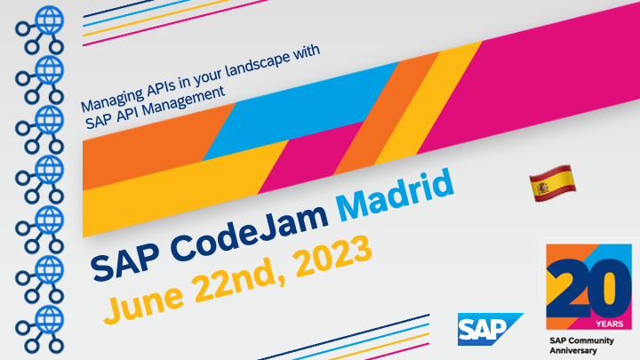
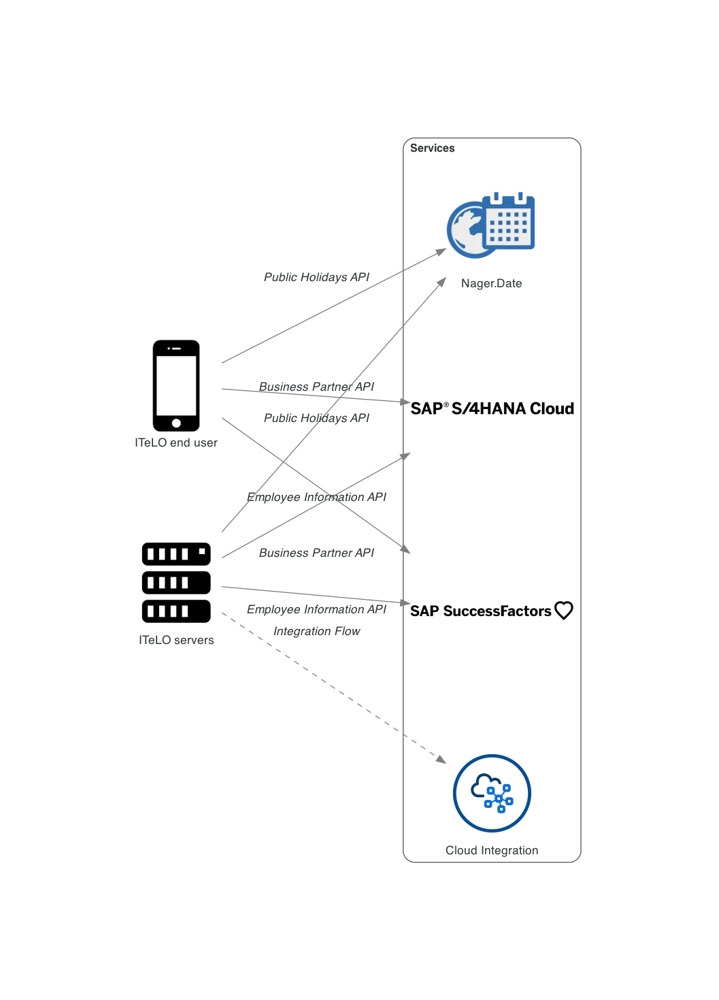
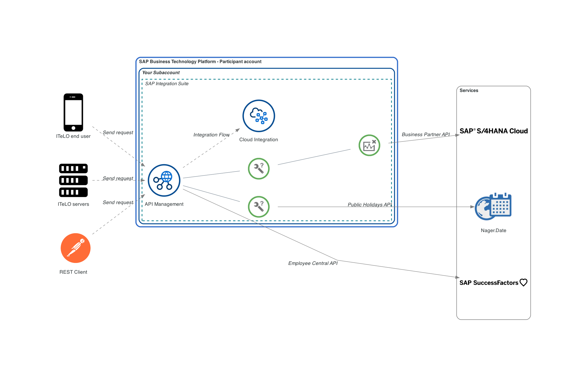

# Managing APIs in your landscape with SAP API Management

---
## *SAP CodeJam events scheduled*

- 2023-06-22: 🇪🇸 SAP CodeJam BTP: Managing APIs in your landscape with SAP API Management (Madrid, Spain) - [RSVP here 🗓️](https://groups.community.sap.com/t5/sap-codejam/sap-codejam-btp-managing-apis-in-your-landscape-with-sap-api/ev-p/259451).

     
    <i>SAP CodeJam in Madrid</i>

---

Welcome to the Managing APIs in your landscape with SAP API Management CodeJam repository. In this SAP CodeJam, we will look at SAP API Management part of the SAP Integration Suite and how we can use it to manage the different APIs exposed by our systems and services.

## API Management Scenario

     
    <i>As is - Current data flow without SAP API Management</i>

We work for a company, ITeLO. ITeLO is a large enterprise with offices in 50 different countries. They currently use SAP S/4HANA Cloud as their main ERP and SAP SuccessFactors to manage their employees. Also, within their organization they have multiple development teams and they want to standarise how developers discover/consume/manage the APIs exposed by the variety of systems that they have in-house and external APIs that are consumed by their internal systems. 

Our task is to make accessible and organise the APIs from/consumed by the different systems/services in our landscape. Also, we want to control/limit the number of paths/operations exposed for certain APIs, e.g. the SAP S/4HANA Cloud Business Partner API.

By the end of the CodeJam, we will achieve an API Management scenario like the one below in the diagram.

     
    <i>To be - Managing our APIs with SAP API Management</i>

## Prerequisites

The prerequisites to follow the exercises in this repository, including hardware and software, are detailed in the [prerequisites](prerequisites.md) file.

### Live system

As part of this CodeJam we will try to provide access to a live SAP S/4HANA Cloud instance. Whenever you see the following emoji - 🔐 - in the exercises, it means that your instructor will provide details to configure a live system. 

<i>What if a live system can't be provided as part of the CodeJam or you are going through the CodeJam content on your own?</i>

 

There are two options here:
1. Use the sandbox environment available as part of the SAP Business Accelerator Hub. When authenticating against the service you will need to specify your API key as a header parameter in the requests.
1. The participant can configure a live system that they have access to.

## Material organization

The material consists of a series of exercises. These exercises build on each other and should be completed in the given order. For example, we start by creating a simple integration flow, and we will extend it in the subsequent exercises.

The repository includes some [slides](slides.md), which will be used when running an SAP CodeJam event. The slides were built using [Marp](https://github.com/marp-team/marp/) and an HTML export is included [here](slides.html). You can also [preview the slides here](https://htmlpreview.github.io/?https://github.com/SAP-samples/manage-apis-codejam/blob/main/slides.html).

## Exercises

During the CodeJam you will complete each exercise one at a time. At the end of each exercise, questions are included to help you think about the content just covered and are to be discussed with the entire CodeJam class, led by the instructor, when everyone has finished that exercise.

If you finish an exercise early, please resist the temptation to continue with the next one. Instead, explore what you've just done and see if you can learn more about the subject covered. That way, we all stay on track together and can benefit from some reflection via the questions (and answers).

See below for an overview of the exercises part of this CodeJam.

* Please ensure that you have completed all the [prerequisites](prerequisites.md).
* Exercises:
    * [Exercise 01 - The OpenAPI specification](./exercises/01-open-api-specification/README.md#exercise-01---the-openapi-specification)
    * [Exercise 02 - Getting familiar with the SAP Business Accelerator Hub](./exercises/02-getting-familiar-business-accelerator-hub/README.md#exercise-02---getting-familiar-with-the-sap-business-accelerator-hub)
    * [Exercise 03 - Discover and import an API](./exercises/03-discover-and-import-api/README.md#exercise-03---discover-and-import-an-api)
    * [Exercise 04 - Deploy an API](./exercises/04-deploy-an-api/README.md)
    * [Exercise 05 - Testing an API using the API Test Console](./exercises/05-testing-api/README.md)
    * [Exercise 06 - Publishing our API](./exercises/06-publish-api/README.md)
    * [Exercise 07 - Import an API using an OpenAPI specification](./exercises/07-import-api-openapi-spec/README.md)
    * [Exercise 08 - Add an SAP SuccessFactors Employee Central API](./exercises/08-add-ssff-employee-central-api/README.md)
    * [Exercise 09 - Monitoring APIs](./exercises/09-monitoring-apis/README.md)
    * [Exercise 10 - API policies](./exercises/10-api-policies/README.md)
    * [Exercise 11 - Consume protected APIs by creating an application](./exercises/11-consume-applications/README.md)
    * [Exercise 12 - Protecting our APIs](./exercises/12-protecting-apis/README.md)
    * [Exercise 13 - Editing API paths, operations, and documentation](./exercises/13-api-designer/README.md)
    * [Optional Exercise 01 - Expose integration flow via API Management](./exercises/optional-01-expose-integration-flow-api-management/README.md)
    * [Optional Exercise 02 - API Security Best Practices](./exercises/optional-02-security-best-practices/README.md)
  
### Troubleshooting

While going through the exercises, you might encounter common problems not explicitly related to them. Check out the [troubleshooting.md](troubleshooting.md) page, which includes a list of these common problems and their potential solutions.

## Known Issues

None

## Feedback

If you can spare a couple of minutes at the end of the session, please help us improve for next time by giving me some feedback.

Simply use this [Give Feedback](https://github.com/SAP-samples/manage-apis-codejam/issues/new?assignees=&labels=feedback&template=session-feedback-template.md&title=Feedback) link to create a special "feedback" issue, and follow the instructions there.

Gracias/Thank you/Obrigado/Merçi/Danke!

## How to obtain support
Support for the content in this repository is available during CodeJam events, for which this content has been designed.

Alternatively, if you are completing this CodeJam on your own, outside of an event, you can [create an issue](https://github.com/SAP-samples/manage-apis-codejam/issues/new) in this repository if you find a bug or have questions about it.
 
For additional support, [ask a question in SAP Community](https://answers.sap.com/questions/ask.html).

## Contributing
Please send a pull request if you wish to contribute code or offer fixes or improvements. Due to legal reasons, contributors will need to accept a DCO when they create the first pull request for this project. This happens in an automated fashion during the submission process. SAP uses [the standard DCO text of the Linux Foundation](https://developercertificate.org/).

## License
Copyright (c) 2023 SAP SE or an SAP affiliate company. All rights reserved. This project is licensed under the Apache Software License, version 2.0 except as noted otherwise in the [LICENSE](LICENSES/Apache-2.0.txt) file.
