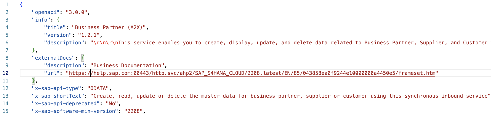

# Exercise 01 - The OpenAPI specification

In this exercise, we will learn about the OpenAPI specification. We start here as it is a critical concept that we will use at different points in this CodeJam and something that you will be using as more and more APIs are exposed via SAP API Management.

     
    <i>OpenAPI initiative</i>

     
    <i>OpenAPI specification logo</i>

## What is an OpenAPI specification?

> From the specification [website](https://swagger.io/specification/)...
>  
> *The OpenAPI Specification (OAS) defines a standard, language-agnostic interface to RESTful APIs which allows both humans and computers to discover and understand the capabilities of the service without access to source code, documentation, or through network traffic inspection. When properly defined, a consumer can understand and interact with the remote service with a minimal amount of implementation logic.*
> 
> *An OpenAPI definition can then be used by documentation generation tools to display the API, code generation tools to generate servers and clients in various programming languages, testing tools, and many other use cases.*

In simple terms, the specification is a document that describes an API. 

## History of the OpenAPI specification

The OpenAPI specification was donated to the Linux Foundation under the [OpenAPI Initiative](https://www.openapis.org/) back in 2015. Before this, it was known as Swagger specification. You might bump into some websites/documentation that still refers to the specification as Swagger or use Swagger and OpenAPI spec interchangeably. The proper name is OpenAPI, not Swagger or Open API, and it is how I will refer to it.

> [Swagger](https://swagger.io/) is a collection of tools for API development created by [SmartBear Software](https://smartbear.com/). One of its most popular tools, and one that you’ve probably seen around, is [Swagger UI](https://swagger.io/tools/swagger-ui/). Swagger UI is commonly embedded in products, to allow developers to test the APIs that they publish. You can see a Swagger UI in the SAP Ariba Developer Portal or the API Business Hub Enterprise. Unfortunately, people commonly refer to Swagger UI as just Swagger which can be confusing at times.

## Why is it important?

The OpenAPI specification is an industry-standard, it is widely adopted by different vendors/services to document their APIs and there is a [huge community](https://openapi.tools/) behind it. SAP has adopted the OpenAPI spec to document its APIs, e.g. in the SAP Business Accelerator Hub you can find the OpenAPI spec for the APIs exposed by the different products. If you download the JSON file listed within the [SAP S/4HANA Cloud Business Partner API](https://api.sap.com/api/API_BUSINESS_PARTNER/overview) (`API resources > API specification > JSON`) and inspect it, you'll notice that it follows the OpenAPI spec `3.0.0`. Also, various SAP products, e.g. [SAP Process Automation](https://help.sap.com/docs/PROCESS_AUTOMATION/a331c4ef0a9d48a89c779fd449c022e7/609538e04bc843d887011765c14ecdda.html?locale=en-US), [API Management](https://help.sap.com/docs/SAP_CLOUD_PLATFORM_API_MANAGEMENT/66d066d903c2473f81ec33acfe2ccdb4/3ce080d478a34256b5dd4e971e7961f8.html?locale=en-US), [Cloud Integration](https://help.sap.com/docs/CLOUD_INTEGRATION/4b57f249012e4e1f8c15cbd5dbb4fff3/fb7c1df576d94516937ce773c456068a.html?locale=en-US), [SAP Data Intelligence](https://help.sap.com/docs/SAP_DATA_INTELLIGENCE/ca509b7635484070a655738be408da63/439278cbff87491c802d75de8cc5c97f.html?locale=en-US), use OpenAPI spec to define/consume APIs.

     
    <i>Business Partner API - specification</i>

## What does an OpenAPI spec look like?

The OpenAPI spec can be in JSON or YAML format. To get familiar with the content of an OpenAPI spec document, let’s look at the OpenAPI spec of an API available in the Business Accelerator Hub. If you download the JSON file listed within a product API, e.g. SAP S/4HANA Cloud – [Business Partner API (A2X)](https://api.sap.com/api/API_BUSINESS_PARTNER/overview) (API resources > API specification > JSON), and inspect it. You’ll notice a structure like the one in the screenshots below.

In the OpenAPI spec, there are only 3 required sections – `openapi`, `info`, and `paths`:

     
    <i>OpenAPI specification document - headers</i>

- `openapi`: We can see that the spec below follows the OpenAPI spec version 3.0.0.
- `info`: Includes some metadata of the API.
- `paths`: This section tells us all the available paths.

    

         
        <i>OpenAPI specification paths</i>
    

    Specification extensions: All the `x-` fields, e.g. `x-sap-api-type`, `x-sap-shortText`, `x-sap-api-deprecated`, that are included in the image above are extension fields. In this case, they are there to document additional information for the different types of APIs that SAP products expose. The SAP Business Accelerator Hub process these specification extensions to better reflect the APIs in the UI.
- `operations`: A path can have multiple operations (GET, PUT, POST, DELETE, etc.) for the API. You can think of operations as the HTTP methods allowed for a path.

All other sections in the spec, e.g. `components`, `externalDocs`, `security`, `servers`, `tags` are optional. In the screenshots, we can see that these have been specified for the API but they might not be included, e.g. if there is no server information or no security in the API. Let’s explore these optional sections:

- `components`: Contains the schemas of the different data structures expected by our API. Defining this can help developers understand the different objects and their structures.
- `externalDocs`: Additional external documentation.
- `security`: Security mechanism supported by the API, e.g. Basic authentication, OAuth 2.0.
- `servers`: Connectivity information for the server(s) where the API is available.
- `tags`: Additional metadata can be provided in this section.

🧭 Take some time to explore the SAP S/4HANA Cloud  Business Partner API (A2X) OpenAPI specifications ([YAML](assets/API_BUSINESS_PARTNER.yaml), [JSON](assets/API_BUSINESS_PARTNER.json) format) included in this exercise.

Also, it is important to highlight that the OpenAPI specification has been adopted in different SAP products:
- Cloud Application Programming model:
  - [Generate an OpenAPI spec](https://cap.cloud.sap/docs/advanced/openapi) for a service
  - Import an [OpenAPI spec as an external service](https://cap.cloud.sap/docs/releases/jun22#import-openapi)
  - Include [Swagger UI](https://cap.cloud.sap/docs/advanced/openapi#swagger-ui) as part of the CAP service: Embedded in Node.js
- SAP Cloud SDK: Generate an OpenAPI client using [openapi-generator](https://sap.github.io/cloud-sdk/docs/js/features/openapi/generate-openapi-client).
- SAP Data Intelligence: Has two operators, OpenAPI Client and OpenClient Server, which can interact with an OpenAPI specification document.
- SAP Build Process Automation: You can call external services from SAP Build Process Automation by using the [Actions Project](https://help.sap.com/docs/PROCESS_AUTOMATION/a331c4ef0a9d48a89c779fd449c022e7/609538e04bc843d887011765c14ecdda.html?locale=en-US).
- SAP Integration Suite:
  - Cloud Integration: You can define a source/target message in Cloud Integration by importing an OpenAPI spec JSON file.
  - API Management: API Management is THE product SAP offers to build, design, publish, analyse, consume, monetise your APIs

## Summary

We've learnt about OpenAPI specifications, the different parts that compose a specification, and how different SAP products have adopted the OpenAPI specification. We will be using OpenAPI specifications in different exercises throughout this CodeJam.

## Further reading

* [OpenAPIs in the SAP ecosystem](https://blogs.sap.com/2022/10/10/openapis-in-the-sap-ecosystem/)
* [OpenAPI.tools](https://openapi.tools/)
* [Additional Attributes in OpenAPI Specification](https://help.sap.com/docs/SAP_CLOUD_PLATFORM_API_MANAGEMENT/66d066d903c2473f81ec33acfe2ccdb4/35f357c811f546c5ae3451df42f61ea0.html?locale=en-US)

---

If you finish earlier than your fellow participants, you might like to ponder these questions. There isn't always a single correct answer and there are no prizes - they're just to give you something else to think about.

1. Take some time and get familiar with some of the tools available in the OpenAPI ecosystem - https://openapi.tools/
2. Can you think of how can you generate an OpenAPI specification from something like a Postman collection?

## Next

Continue to 👉 [Exercise 02 - Getting familiar with the SAP Business Accelerator Hub](../02-getting-familiar-business-accelerator-hub/README.md#exercise-02---getting-familiar-with-the-sap-business-accelerator-hub)

[^1]: OpenAPI Specification: [https://github.com/OAI/OpenAPI-Specification/blob/main/versions/3.0.3.md#infoObject](https://github.com/OAI/OpenAPI-Specification/blob/main/versions/3.0.3.md#infoObject)
