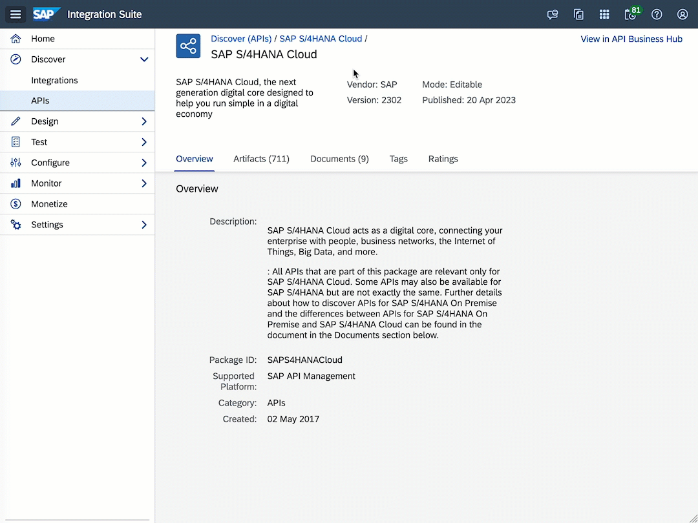

# Exercise 03 - Discover and import an API

At the end of this exercise, you'll have successfully searched for an API listed in the SAP Business Accelerator Hub, via the Discover functionality in SAP API Management, and imported the API to your instance.

     
    <i>To be - SAP S/4HANA Cloud Business Partner API</i>

## Discover APIs

 In the Discover > APIs section of SAP Integration Suite, you'll be able to find [all the API packages that you can access via the SAP Business Accelerator Hub](https://api.sap.com/content-type/API/apis/packages). This includes API packages for SAP products, as well as API packages made available by SAP partners.

 In a previous exercise, we got familiar with the [Business Partner API](https://api.sap.com/api/API_BUSINESS_PARTNER/overview) available in SAP S/4HANA Cloud. This same API can be accessed via API Management. Let's do just that.... 

👉 We navigate to the Discover section and click on the APIs item. Search for `SAP S/4HANA Cloud` API package.

<i>Discover section - search for API package</i>

An API package can contain multiple artefacts (APIs), which can be of several types, e.g. OData V4, SOAP, OData, REST. You'll also notice here that you can see this package in the SAP Business Accelerator Hub by clicking the link in the top right corner. 

The artefacts list can contain many APIs, e.g. SAP S/4HANA Cloud has more than 700 artefacts. Fortunately, we can filter the artefacts by name. Let's search for the API we explored in the previous exercise.

👉 Filter the artefacts list by `Business Partner (A2X)`.

<i>Filter API package artefacts list</i>

We can see that the `Business Partner (A2X)` API is of type OData, its version (1.3.0). If we navigate to the API, we will be able to see all the resources that are part of this API.

<i>Business Partner (A2X) - Resources</i>

There is also an `Overview` tab where we can find information such as description, version, minimum software version, created on, last modified, and communication scenarios, which are related to the API can be found.

Now that we've found the API that we are interested in, let's see how we can import it into our SAP API Management instance.

## Import API

To import the API, we will need to Copy the artefact to our API Management instance. By copying the artefact to our instance, our instance will keep a reference of the object in SAP Business Accelerator Hub. If there is an update to this object, we will be able to easily update it from our instance.

👉 Click the `Copy` button that's in the upper right corner of the screen. Set the service host and port. Also, the API details are required. 
> 🔐 *Your instructor will provide you with the host that you can use.*

<i>Copy API - details</i>

Once the API was copied successfully, it will be listed within the `Configure > API` section of Integration Suite. The screen below shows us basic information about our API, e.g. Status, Type, who changed it last and when was it last updated. We can see that the status of the API is Not Deployed, meaning that it is still not possible to access it through SAP API Management.

)

<i>Configure > API - List</i>

<i>ℹ️ This action can also be performed from the API Package list. Every item listed has an actions button which contains the <code>Copy</code> action</i>

 

<i>Artifact - Copy action</i>

## Summary

Now that you are familiar with how we can search for the content available in SAP Business Accelerator Hub, via SAP API Management, how we can import and configure the API in our instance. In the next exercise, we'll see what we will need to do to publish the API and make it available to developers in our organization.

## Further reading

* [Discover API Packages](https://help.sap.com/docs/sap-api-management/sap-api-management/discover-api-packages?locale=en-US)
* [API Package details](https://help.sap.com/docs/sap-api-management/sap-api-management/package-details?locale=en-US)

---

If you finish earlier than your fellow participants, you might like to ponder these questions. There isn't always a single correct answer and there are no prizes - they're just to give you something else to think about.

1. Depending on the capabilities enabled in your SAP Integration Suite instance, there may be more items listed under the Discovery section, e.g. Integrations. Explore other items listed under this section and find more content that's available in the SAP Business Accelerator Hub.
2. Which other artefact types can be found in an API package? Hint: there is more than just APIs... you can search for the `Connect to SAP Cloud Foundry Services` API package.
3. Can you think of a reason why it would be better to copy an API artefact from within our instance, instead of downloading the API specification from SAP Business Accelerator Hub and manually importing the specification?

## Next

Continue to 👉 [Exercise 04 - Deploy an API](../04-deploy-an-api/README.md)