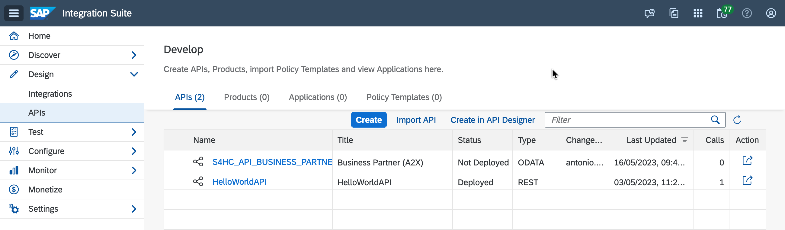
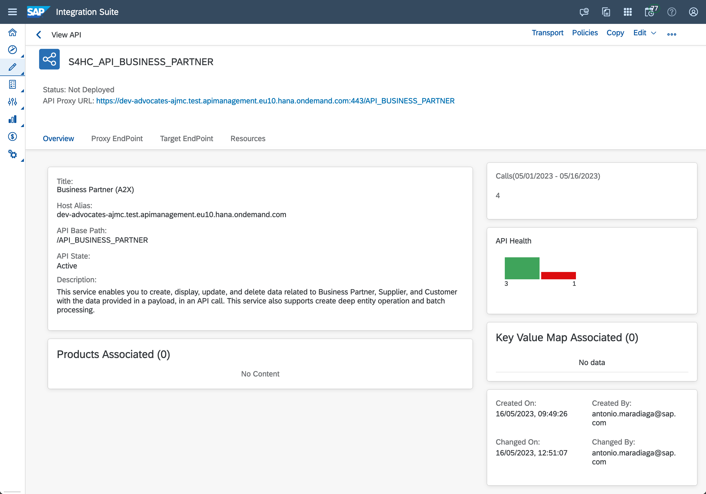
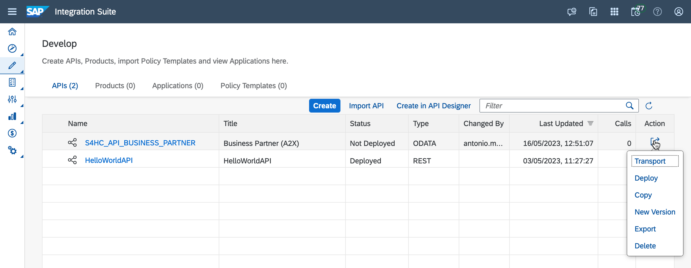
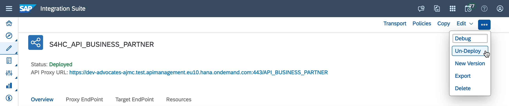

# Exercise 04 - Deploy an API

In the previous exercise, we created an API by importing an API package that's available in the SAP Business Accelerator Hub. The API that we copied to our instance is the [Business Partner (A2X) API package](https://api.sap.com/api/API_BUSINESS_PARTNER/overview) and in this exercise, we will check out the different parts of the API proxy we created.

> [API Proxy](https://help.sap.com/docs/sap-api-management/sap-api-management/api-proxy?locale=en-US): The proxy is  a representation of the backend system API. This allows us to configure custom behaviour in our API, as well as monitor calls API or apply policies to our API. All this without the need of actually modifying the underlying API. Which means that client applications that call the exposed API via SAP API Management will not be calling the underlying API directly, but the call will be performed by SAP API Management on their behalf.

At the end of this exercise, you'll have successfully deployed an API that you've created manually or imported from the SAP Business Accelerator Hub.

## Deploy an API

The current status of the API we imported is `Not Deployed`. Meaning that we aren't able to do much with it in its current state. No one will be able to communicate with this API through SAP API Management. We need to deploy it to make it available on the Internet.

<i>Undeployed Business Partner API</i>

👉 Access the API by clicking the item, e.g. `S4HC_API_BUSINESS_PARTNER`, in the list.

From here we can see the details of the API as well as configure the API further. Below is a description of the different sections and actions that we can take on our API from here. We will explore some of this in various exercises through this CodeJam.

- *Proxy Endpoint*: Manages interactions with API consumers. Consumers of the API normally interact with the base path of the API and are attached to policy entities that operate to define the behaviour of the API.
- *Target Endpoint*: Manages interactions with the backend service endpoint on behalf of consumer applications. The backend endpoint forwards request messages to the proper backend service. Here we can find the host and port that we set when creating the API.
- *Resources*: Individual business entities that an API proxy contains, e.g. `BusinessPartner` is an API resource that the API administrator would like to present via an API Proxy entity.
- *Transport*: The API artefacts created and their content can be reused across multiple tenants. You can use the [SAP Cloud Transport Management System](https://discovery-center.cloud.sap/serviceCatalog/cloud-transport-management?region=all) for exporting, importing and shipping the API from a dev/test environment to production.
- *Policies*: API Management provides capabilities to define the behaviour of an API by using 'policies.' A policy is a program that executes a specific function at runtime. They provide the flexibility to add common functionalities to an API without having to code them individually each time. Policies provide features to secure APIs, control the API traffic, and transform message formats. You can also customize the behaviour of an API by adding scripts and attaching them to policies. 
- *Edit*: Once we've created an API proxy we can further change it/add functionality by editing it.
- *Debug*: You debug an API proxy to troubleshoot and monitor them in SAP API Management, by checking the details of each step through the API proxy flow.
- *Deploy*: We need our API to be deployed so that it's available on the internet.

<i>S4HC_API_BUSINESS_PARTNER API - Overview</i>

👉 Click on the different tabs, e.g. `Proxy EndPoint`, `Target EndPoint`, `Resources`, and get familiar with the data that's displayed. We will revisit them in future exercises.

> 👀 Notice that there are no product associated to the API. We will create a Product and associate an API to it in a future exercise.

No changes are required for our API at the moment, it is good as it is so we can proceed to deploy it.

👉 Expand the `Additional options` and click `Deploy`.

<iAdditional options - >DeploI</i>

<i>ℹ️ This action can also be performed from the <code>Configure > APIs</code> list. Every item listed has an actions button which contains the <code>Deploy/Undeploy</code> action</i>

 

<i>API actions</i>

This is an action that we will need regularly, e.g. as we update/modify the behaviour in our API, as we will need to redeploy (deploy) the API for our changes to be active.

### Optional - Undeploy an API

There are instances where we would want to un-deploy an API, e.g. decommissioning an old API. Once the API is undeployed, it will no longer be accessible on the Internet.

> Note: There is no need to un-deploy an API to make changes to it. We can just edit the API and the changes will not be active until we re-deploy the API.

⌥ To un-deploy an API, access a deployed API, expand the `Additional options` and click `Un-Deploy`. Same as before, this action can be performed directly from the Configure > APIs list.

<i>Un-Deploy API</i>

## Summary

We've deployed our first API in SAP API Management. This API is now accessible via the Internet and it is an essential step before we can call it through SAP API Management. Now that it is exposed via the Internet, we can proceed to call it in the next exercise.

## Further reading

* [Deploy an API](https://help.sap.com/docs/sap-api-management/sap-api-management/deploy-api?locale=en-US)
* [Restrictions when undeploying an API - refer to step 19](https://help.sap.com/docs/sap-api-management/sap-api-management/create-api?locale=en-US)

---

If you finish earlier than your fellow participants, you might like to ponder these questions. There isn't always a single correct answer and there are no prizes - they're just to give you something else to think about.

1. We've configured and deployed an API proxy for an API that's publicly available on the Internet. Can we do the same for an API in an on-premises system?
    

    
Hint 🔦

    <i>We can configure connectivity with an on-premises system by using an <a href="https://help.sap.com/docs/sap-api-management/sap-api-management/create-api-provider?locale=en-US">API provider</a>. </i>
    

   
2. Try un-deploying and deploying your API. What happens? When is it that we can't un-deploy an API?
   

   
Hint 🔦

   <i>Step 19 -> <a href="https://help.sap.com/docs/sap-api-management/sap-api-management/create-api?locale=en-US">Create an API</a>.</i>
   

## Next

Continue to 👉 [Exercise 05 - Testing an API using the API Test Console](../05-testing-api/README.md)