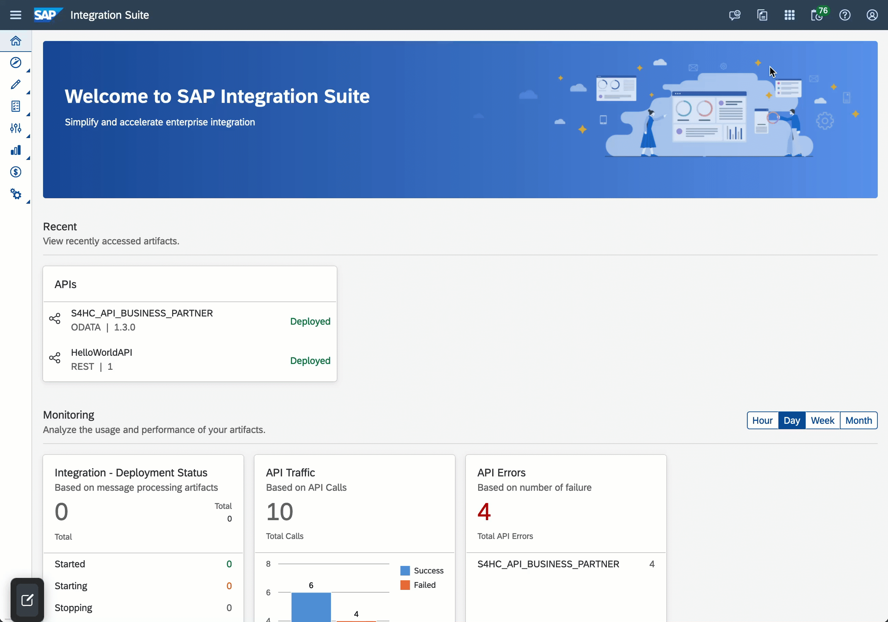
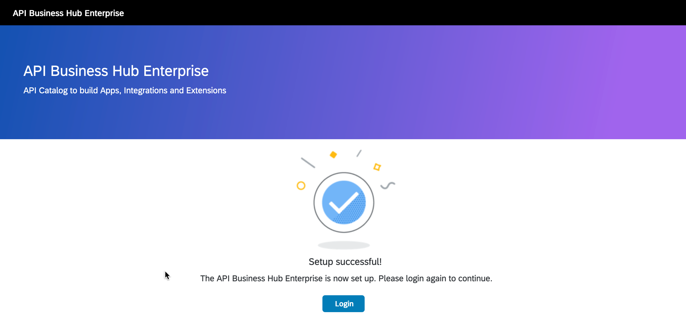
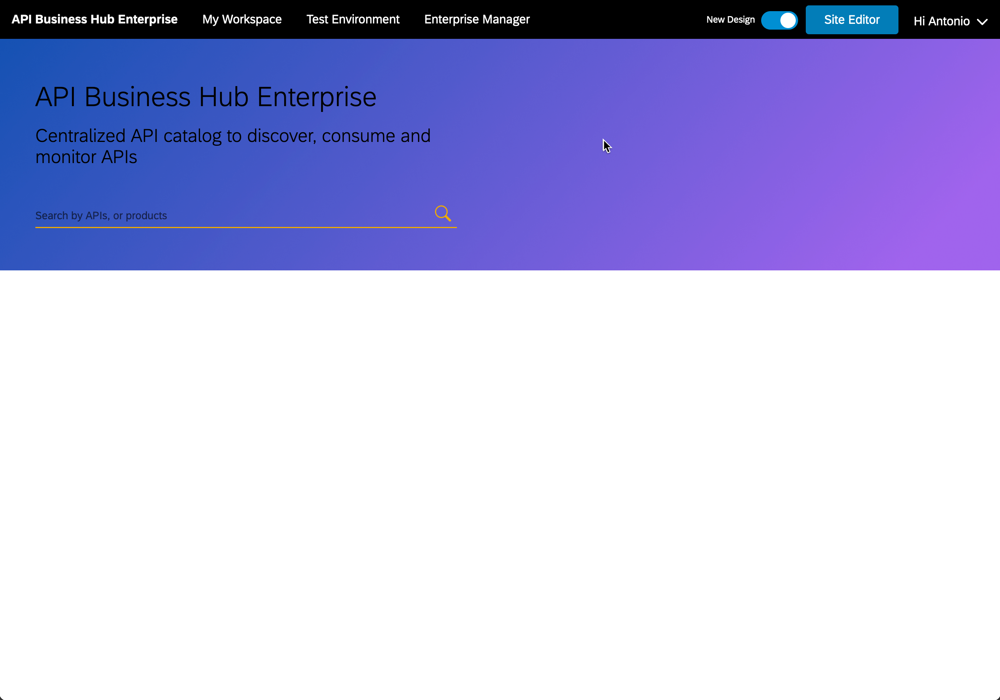
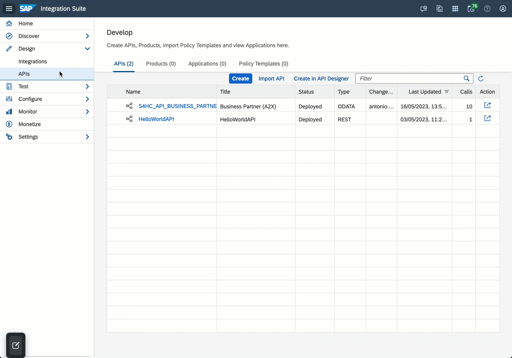
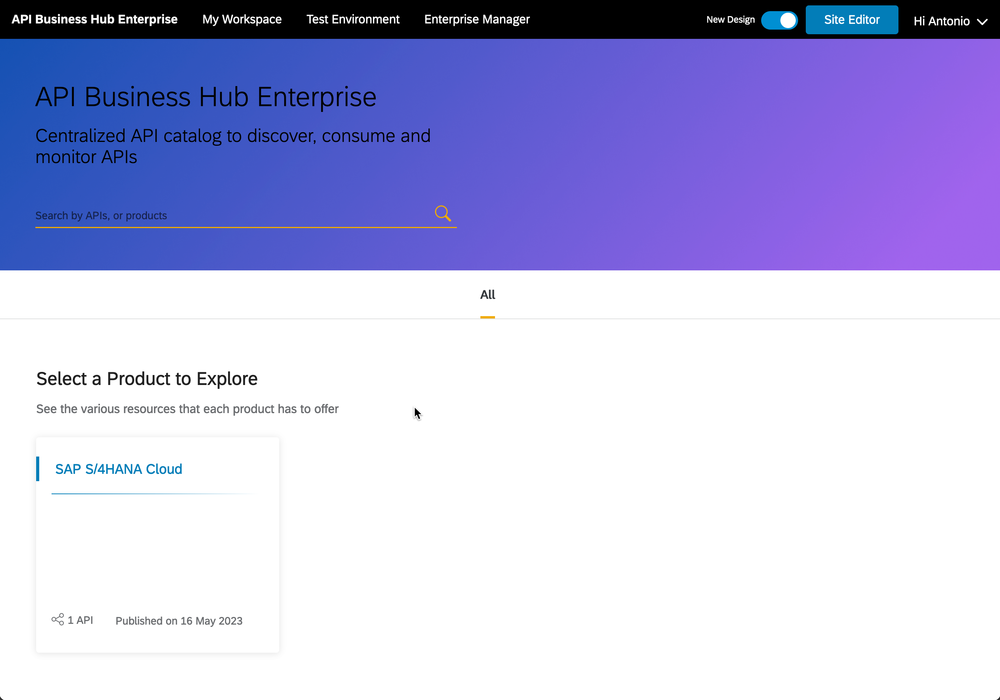

# Exercise 06 - Publishing our API

We've published our API but the API is not yet easy to discover by other developers within our organisation. Fortunately, SAP API Management includes a Developer Portal. Let's dive into this.

At the end of this exercise, you'll be familiar with the API Business Hub Enterprise and the process of publishing a product and APIs in it.

## API Business Hub Enterprise

The API Business Hub Enterprise is a capability part of SAP Integration Suite. It is a portal that allows developers to register, explore the APIs exposed in our instance of SAP API Management, and create applications that can be used to consume the APIs.

👉 Let's access the API Business Hub Enterprise from the SAP Integration Suite home. Click the `Explore our Ecosystem` button on the top right corner of the page and select the `API Business Hub Enterprise` tile.

<i>Link to API Business Hub Enterprise</i>

If this is the first time you are accessing the API Business Hub Enterprise, you will be greeted with a screen like the one below.

<i>First-time access</i>

👉 Click the Login button to proceed. You will be redirected to the API Business Hub Enterprise where no content will be displayed as we haven't published any products.

API Business Hub with no content

 

Let's go ahead and create some objects so that developers can find our APIs in the API Business Hub Enterprise.

## Create a Product

So far we've imported an API and configured the host and port details of our server. As we are interacting with a server that's publicly exposed, we don't need to configure anything in particular for our API.

You might have noticed that the API we imported is one of many APIs exposed by SAP S/4HANA Cloud. Logically, we might want to keep all the APIs that belong to a specific product together (grouping). This is possible in SAP API Management by creating a `Product` and assigning the relevant APIs to a product.

👉 In SAP Integration Suite, navigate to `Design > APIs`, select the `Products` tab and click the `Create` button.

<i>Create product in SAP API Management</i>

Enter the details below:
* Name: `S4HC`
* Title: `SAP S/4HANA Cloud`

We've entered the basic details of our Product but we are missing specifying the APIs that we want to associate to it. Let's associate the `S4HC_API_BUSINESS_PARTNER` API that we created before.

👉 Select the `API` tab and click the `Add` button. Select the `S4HC_API_BUSINESS_PARTNER` API. Given that it is the only change that we want to do, you can go ahead and `Publish` the product.

<i>Associate API and publish product</i>

If we navigate back to the API Business Hub Enterprise, we'll see that our Product is now listed on the page.

<i>SAP S/4HANA Cloud Product in API Business Hub Enterprise</i>

Success! Our API can now be discovered by other developers in our organization.

## Re-publish a Product

Similar to the Deploy action when interacting with APIs, the `Publish` action is something that we will need regularly, e.g. as we update/modify the Product or associate additional APIs to a product. Let's go ahead and do a quick change and publish again our Product.

We are going to set `The next generation digital core designed to help you run simple in a digital economy. It provides the industry-specific capabilities and cloud benefits that your business needs.` as the short text description of our `S4HC` product.

👉 Edit the `S4HC` product and set the short text above in the short text field. Once done, `Publish` the Product. 

<i>Edit S4HC product and publish</i>

The tile in the API Business Hub Enterprise will now contain a description of the product.

## Summary

Now that you are familiar with the basic functionality of SAP Business Accelerator Hub and the Business Partner API, we are ready to start interacting with the services from which our integration will be extracting data.

## Further reading

* [Publish APIs in SAP API Management](https://help.sap.com/docs/sap-api-management/sap-api-management/publish-apis?locale=en-US)
* [Restricting access to an API product](https://help.sap.com/docs/sap-api-management/sap-api-management/creating-custom-role?locale=en-US)

---

If you finish earlier than your fellow participants, you might like to ponder these questions. There isn't always a single correct answer and there are no prizes - they're just to give you something else to think about.

1. The API we published is public to all developers that have access to our developer portal. How can we restrict access to who can view the APIs?
2. What happens if you try deleting the `S4HC_API_BUSINESS_PARTNER` API without removing it from the product?

## Next

Continue to 👉 [Exercise 07 - ](../07-add-bank-api-to-s4hc-product) -->