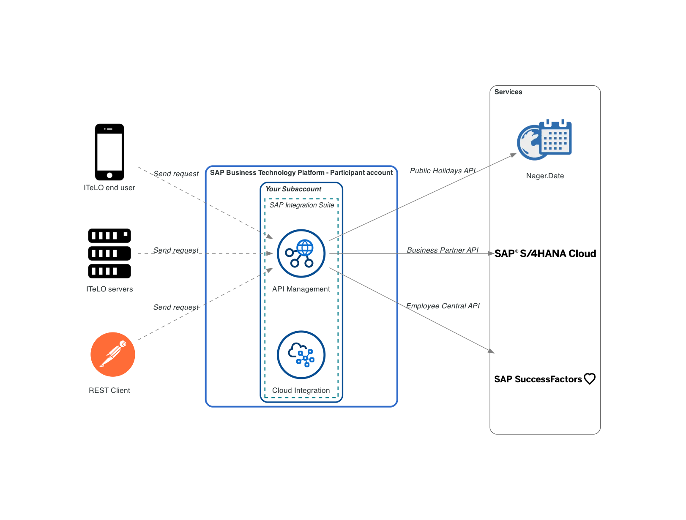

# Exercise 08 - Add an SAP SuccessFactors Employee Central API

Now that we are familiar with the basic functions of creating, saving, deploying, and publishing an API, we will start moving a bit faster 🏎️. In this exercise, we will reinforce what we've learned in exercises 02-06 and import the [Personal Information API](https://api.sap.com/api/ECPersonalInformation/overview) that's part of [SAP SuccessFactors Employee Central](https://api.sap.com/package/SuccessFactorsEmployeeCentral/all).

At the end of this exercise, you'll have successfully published a new product and you'll be familiar with the sandbox environment part of the SAP Business Accelerator Hub.

     
    <i>To be - SAP SuccessFactors Employee Information API</i>

## Personal Information API

The Personal Information API part of SAP SuccessFactors Employee Central provides us access to the personal information of an employee. For example, we can retrieve emergency contact information, social media accounts, email address and non-effective-dated biographical information. Let's get familiar with the resources exposed in the Personal Information API.

👉 Navigate to the SAP Business Accelerator Hub and search for Personal Information in the search bar. Check out the resource available as part of the API.

     
    <i>Search for Personal Information API</i>

## Add the Personal Information API and publish it to the API Business Hub Enterprise

Now that we are familiar with the API, let's go ahead and make the Personal Information API available in our SAP API Management instance.

👉 Remember that we got to discover, copy, configure, and deploy the API. Below are the steps that you need to follow:
- Discover the API: Search for `SAP SuccessFactors Employee Central`
- Filter artefacts: Search for `Personal Information`
- Copy API
  - Configure the API so it connects to the sandbox environment of the SAP Business Accelerator Hub. Select `https://sandbox.api.sap.com/successfactors/odata/v2` as the Service URL.
- Deploy API

The gif below captures the steps that you got to perform to search and copy the API.

     
    <i>Discover and Copy the Personal Information API</i>

The new API is now available through our SAP API Management instance but it is not discoverable via the API Business Hub Enterprise. Let's fix that.

👉 Create the SAP SuccessFactors Employee Central product, add the API just created and publish it.

You can use the details below:
- Title: `SAP SuccessFactors Employee Central`
- Short Text: `SAP SuccessFactors Employee Central serves not only as a system of record for all people- and HR-related data, but also as a platform where everything in the organization comes together to transform the work experience.`
- Description: `SAP SuccessFactors Employee Central serves not only as a system of record for all people- and HR-related data, but also as a platform where everything in the organization comes together to transform the work experience. The HR organization can build value-based relationships with everyone supporting the business – engaging permanent and external workers to collaborate in new ways, using consumer-style tools and social HR. And it can help management design, plan, and implement better people strategies for better business results. One of the main strengths of SAP SuccessFactors Employee Central is its global and unmatched localized capabilities, ensuring legal and corporate compliance and taking into consideration local culture and people’s expectations for broad and seamless adoption.`

     
    <i>Create SSFF product and publish</i>

Once published, our product and API will be listed in the API Business Hub Enterprise. 

## Test from API Business Hub Enterprise

The API Business Hub Enterprise also has a testing environment. Let's use this testing environment to test the API we just published.

👉 Navigate to the API Business Hub Enterprise, click the `Test Environment` link in the top bar, choose the `Personal Information` API and select the PerPersonal resource, e.g. `https://my-instance.test.apimanagement.eu10.hana.ondemand.com:443/successfactors/odata/v2/PerPersonal`. 

Go ahead and send a request as is.

     
    <i>Test Environment in API Business Hub Enterprise - API key error</i>

Unfortunately, you will get an error message like the one shown in the gif below - `Failed to resolve API Key variable request.header.apikey`. Meaning that the service we are calling is expecting an API key. For us to be able to interact with the sandbox environments/data available in the SAP Business Accelerator Hub we need to provide an API key as a header in our request.

> The prerequisites includes instruction on how to get your [SAP Business Accelerator Hub API key](../../prerequisites.md#sap-business-accelerator-hub-api-key).

👉 Add the parameters below to the Test Request and retry making the request

- Header, key: `APIKey`, value: `[YOUR-SAP-BUSINESS-ACCELERATOR-HUB-API-KEY]`
- Query, key: `$top`, value: `5`

     
    <i>Add header and query parameters</i>

👏 🎉 Hooray! The test request was successful and we know that our API is working as expected. Great job!

## Summary

Now we are very familiar with the process of discovering, importing, and deploying APIs. In this exercise, we also learnt some new functionality in the API Business Hub Enterprise and how to retrieve data from the sandbox environment available in the SAP Business Accelerator Hub. Now let's see the out-of-the-box monitoring functionality that SAP API Management provides us.

## Further reading

* [API Business Hub - Configuration and roles](https://help.sap.com/docs/sap-api-management/sap-api-management/configure-api-business-hub-enterprise-new-design?locale=en-US)
* [API Business Hub - Test Environment](https://help.sap.com/docs/sap-api-management/sap-api-management/test-runtime-behavior-of-apis-new-design?locale=en-US)
* [Configuring access to an SAP SuccessFactors API in SAP Build Apps](https://blogs.sap.com/2023/02/01/configuring-access-to-an-sap-successfactors-api-in-sap-build-apps/)

---

If you finish earlier than your fellow participants, you might like to ponder these questions. There isn't always a single correct answer and there are no prizes - they're just to give you something else to think about.

1. The response is in XML format.... how can we specify to the server that we would like our response to be in JSON format?
2. Where can you find the MIME types that an operation can produce?
   

    
Hint 🔦

    <i>Check out the OpenAPI specification document for the API in question.</i>
    

## Next

Continue to 👉 [Exercise 09 - Monitoring APIs](../09-monitoring-apis/README.md)