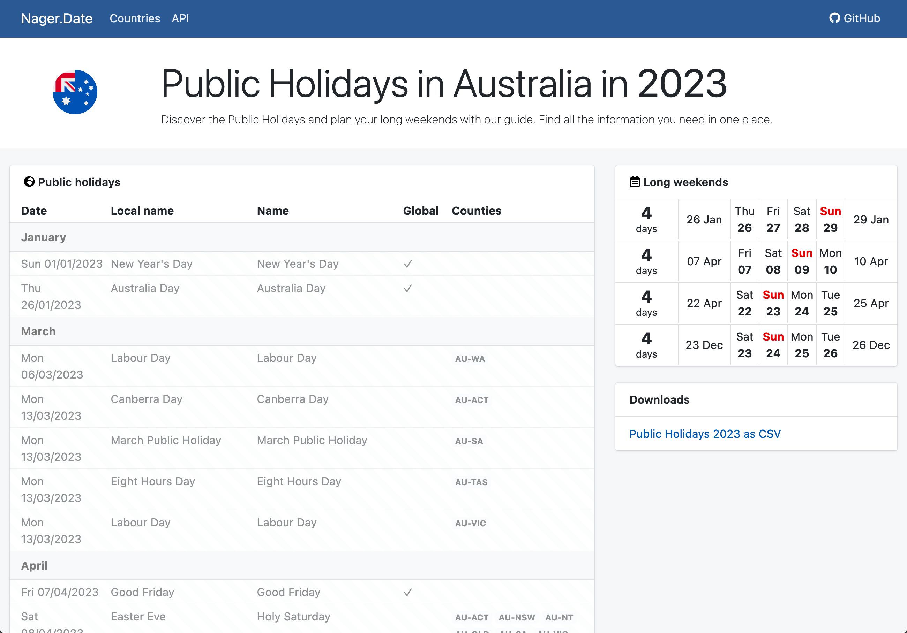

# Exercise 08 - Import an API

So far, we've seen how we can discover, copy, deploy and publish APIs available in the SAP Business Accelerator Hub to our SAP API Management instance. It is also possible to create APIs in SAP API Management, based on OpenAPI specifications. Many products/services available to us publish their API specification and this can ease our development/integration efforts.

At the end of this exercise, you'll have successfully used an OpenAPI specification to create an API and its resources in SAP API Management.

## Public Holidays around the world

As mentioned in the [API Management scenario](../../README.md#api-management-scenario), ITeLO has a global workforce, with many offices around the world. Every country has different public holidays and it is important to know which dates are public holidays in each location, for planning/HR purposes. Currently, different teams maintain this information in different ways, e.g. spreadsheets/consuming different API and the data is not consistent across the organisation. Our goal is to provide a single point of reference (API) that all the different applications in the organisation can use/refer to know the public holidays of the different locations. This will help to harmonise this important data across the organisation.

## Nager.Date - Worldwide Public Holiday

Fortunately for us, there is a public service - [https://date.nager.at/](https://date.nager.at/) -  that can provide us with public holiday information for 110 [countries](https://date.nager.at/Country). All the countries where ITeLO operates are included here so we are good to go.

👉 Visit the website of [Nager.Date](https://date.nager.at/) and check out the public holidays published for the country you are in, e.g. https://date.nager.at/PublicHoliday/Country/AU.

     
    <i>Public Holidays - Australia</i>

Nager.Date makes its data available via an [API](https://date.nager.at/Api). If you visit the [API documentation](https://date.nager.at/swagger/index.html), you'll notice that it shows us a [Swagger UI](https://swagger.io/tools/swagger-ui/), and within the docs there is a link to its [OpenAPI specification](https://date.nager.at/swagger/v3/swagger.json). We can use this specification to create the API in our instance of SAP API Management.

> The OpenAPI specification for Nager.Date's API is also included in the assets folder of this exercise: [./assets/date.nager.at-openapi.json](./assets/date.nager.at-openapi.json)

👉 Take some time to visit the [Nager.Date's API documentation](https://date.nager.at/swagger/index.html), get familiar with the resources available and try sending some requests.

     
    <i>Exploring Nager.Date API</i>

## Create API by importing OpenAPI specification in SAP API Management

Now that we are familiar with the API, let's proceed to make it available to our developers via SAP API Management.

👉 In SAP Integration Suite, navigate to `Design > APIs` and click the `Import` button and select [Nager.Date's OpenAPI specification](./assets/date.nager.at-openapi.json). 

     
    <i>Import Nager.Date's OpenAPI specification</i>

We will manage this API in SAP API Management, this will allow us to change its behaviour which is something that we will do in a future exercise. No need to create a version as the API itself already has versioning.

👉 Set the following values to complete the creation of the API. 
- ***Overview*** tab:
  - *Name*: `PublicHolidays_Nager_Date_API`
  - *Title*: `Public Holidays Worldwide`
  - *Host Alias*: Select your host alias
  - *API Base Path*: `/public-holidays`
  - *Description*: `Powered by Nager.Date - https://date.nager.at/`
- ***Target Endpoint*** tab:
  - *URL*: Replace `https://localhost/` with `https://date.nager.at/`

Once you set the values above, [deploy](../04-deploy-an-api/README.md#deploy-an-api) the API.

> If you try testing any resources before deploying the API, you will get an authentication error in the response. Deploy the API first and then retry.

## Publish the API in the API Business Hub Enterprise

In exercise 06 we went into detail on how to publish an API. Lets repeat the process here.

👉 [Create a new Product](../06-publish-api/README.md#create-a-product), e.g. `General Data`, and associate the `PublicHolidays_Nager_Date_API` to it. [Publish](../06-publish-api/README.md#associate-api-to-product-and-publish) the product.

     
    <i>General Data - Product</i>

## Summary

Exciting! We were able to import an OpenAPI specification and created an API using it. Many services publish OpenAPI specs which can ease how we can create API in SAP API Management.

## Further reading

* [Nager.Date](https://date.nager.at/)
* [Link 2](https://blogs.sap.com/)

---

If you finish earlier than your fellow participants, you might like to ponder these questions. There isn't always a single correct answer and there are no prizes - they're just to give you something else to think about.

1. Check out a [huge list of free APIs](https://mixedanalytics.com/blog/list-actually-free-open-no-auth-needed-apis/) that you might find useful.
2. Second question.

<!-- ## Next

Continue to 👉 [Exercise XX - ](../02-exploring-the-mock-services/README.md#exercise-02---exploring-the-mock-services) -->