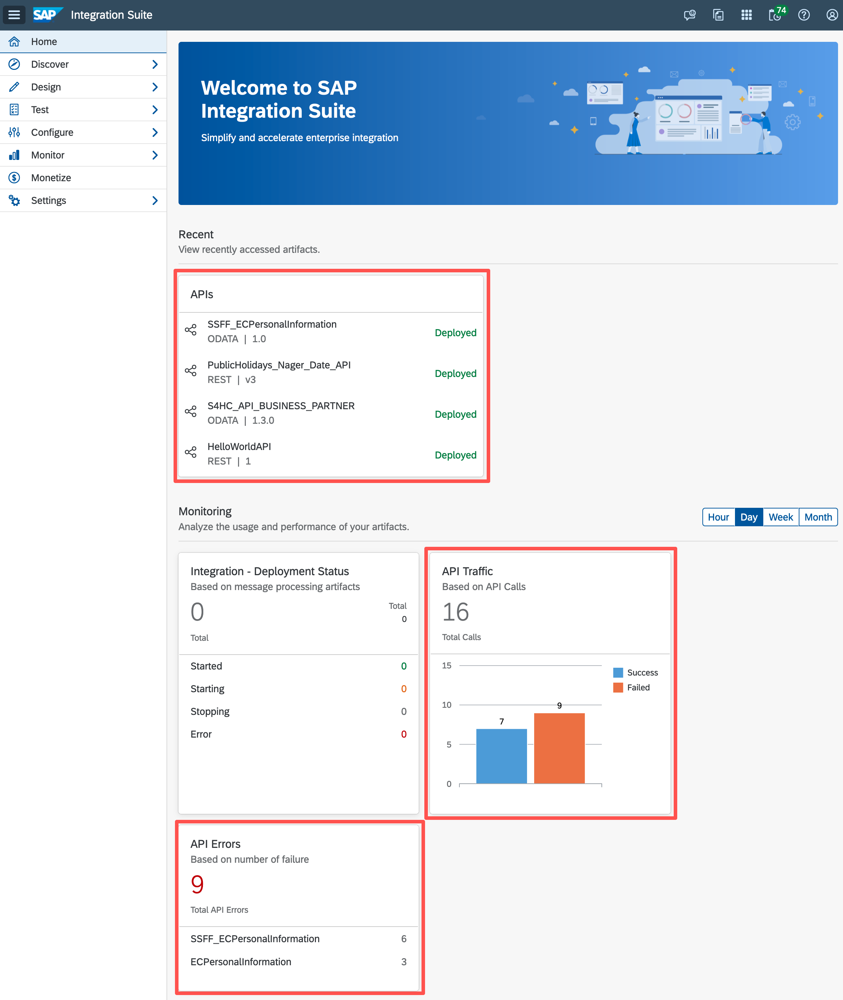
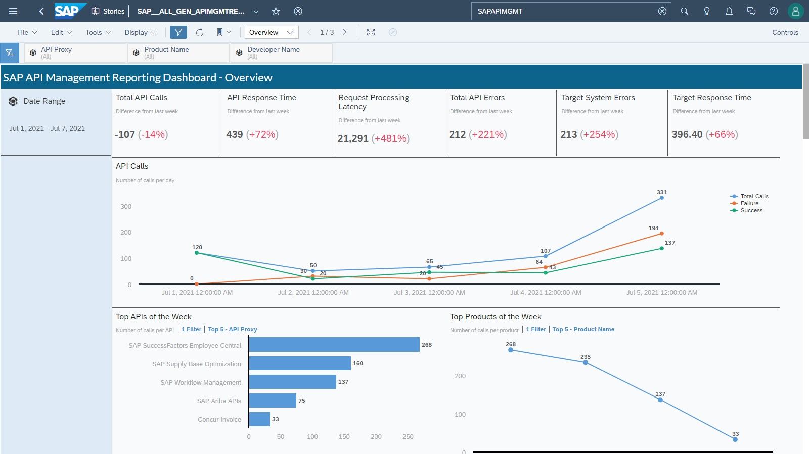
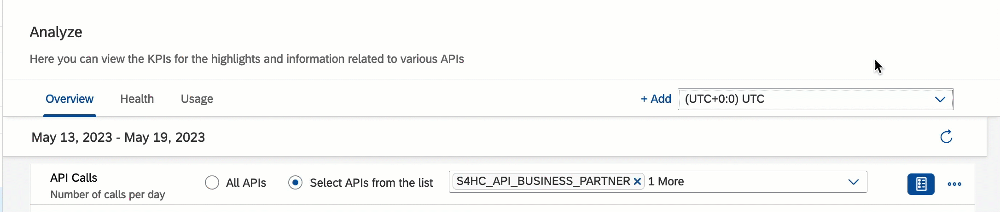
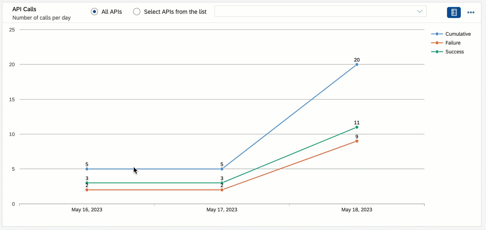

# Exercise 09 - Monitoring API

We've sent a few requests to the APIs published in SAP API Management, some of them have failed, and some of them have been successful. Fortunately, SAP API Management provides a single place where we can monitor the API calls made to our instance. We will be exploring this in this exercise. 

At the end of this exercise, you'll be familiar with the analytic capabilities of SAP API Management.

## SAP Integration Suite - Home Page

The SAP Integration Suite user interface was [recently unified](https://blogs.sap.com/2022/10/10/sap-integration-suite-availability-of-a-common-coherent-user-interface-to-work-with-various-capabilities/). There is now a single UI to access all the capabilities of SAP Integration Suite. As seen on the screenshot below, the home page is already informing us about the API Traffic and Error in our SAP API Management instance.

> The tiles shown in your SAP Integration Suite shown may vary depending on the capabilities enabled for your instance.

     
    <i>SAP Integration Suite - Home Page</i>

👉 Navigate to the SAP Integration Suite home page and find any tiles that provide you with basic information about your SAP API Management artefacts/state.

## Monitoring SAP API Management

SAP API Management provides us with a monitoring capability that will inform us of the usage, state and performance of the APIs in our instance.

> In the data displayed in the dashboard, you'll see that it mentions an unidentified application, an unidentified developer... this is because at the moment there are no restrictions on who can call our published APIs. This might be a desired behaviour for some APIs but definitely not for all APIs. We will address this in a future exercise.

     APIs dashboard" src="assets/monitor-apis-dashboard.png" width="100%"/> 
    <i>Monitor > APIs dashboard</i>

👉 Navigate to the Monitoring page, `Monitor > APIs`, and get familiar with the data in the tiles. 

The dashboard provides us with information such as:
- Top APIs, API providers, HTTP response status codes
- Total API Calls (successful/failed)
- API response time
- Request processing latency
- Total API errors
- Target system errors
- Target response time

## SAP Analytics Cloud for API Management

If SAP Analytics Cloud is used as a reporting solution within your organization, you might be interested to know that there is a reporting dashboard available out-of-the-box for SAP API Management. 

> From the documentation: *The API Management Reporting Dashboard displays runtime data of APIs gathered and analyzed as charts and key performance indicators. The data can be viewed across various report pages namely Overview, Health, and Usage, with each page providing information about key API metrics.*

     
    <i>SAP API Management Reporting Dashboard</i>

The API Management reporting dashboard uses the OData APIs for [connectivity](https://help.sap.com/docs/SAP_ANALYTICS_CLOUD/42093f14b43c485fbe3adbbe81eff6c8/bf5d89513ead4bceba498fc165194cc0.html?locale=en-US), therefore you will need to do some minor setup to allow connectivity between SAP Analytics Cloud and your SAP API Management instance.

## (Optional) Custom Analytics in SAP API Management

It is possible to capture custom data from our APIs and use it as part of our API analytics. SAP API Management allows you to capture and analyse data by using custom dimensions and custom measures. For example, we might want to keep track of a response header that's returned by certain APIs

⌥ 🧐 In case you want to get familiar with creating custom dimensions and tracking them in SAP API Management, check out this [tutorial: Create Custom Dimensions and Measures](https://developers.sap.com/tutorials/api-mgmt-analytics-custom-metrics.html), available in the tutorial navigator.

## Summary

Now that you are familiar with the basic monitoring capabilities of SAP API Management, let's go ahead and start tweaking the behaviour of our APIs.

## Further reading

* [Create Custom Dimensions and Measures](https://help.sap.com/docs/sap-api-management/sap-api-management/create-custom-dimensions-and-measures?version=Cloud&locale=en-US)
* [SAP Analytics Cloud for API Management](https://help.sap.com/docs/sap-api-management/sap-api-management/sap-analytics-cloud-for-api-management?version=Cloud&locale=en-US)

---

If you finish earlier than your fellow participants, you might like to ponder these questions. There isn't always a single correct answer and there are no prizes - they're just to give you something else to think about.

1. The dashboard in Monitor > APIs allows us to specify a time zone. How can you do that?
   

    
🔦 Hint

     

    

         
        <i>Specify time zone</i>
    

    

2. Can you find a way of filtering the total API calls tile to only a subset of the APIs available?
    

    
🔦 Hint

     

    

         
        <i>Select APIs from the list - API Calls tile</i>
    

    

3. Which is the slowest API in your instance? 

<!-- ## Next

Continue to 👉 [Exercise XX - ](../02-exploring-the-mock-services/README.md#exercise-02---exploring-the-mock-services) -->