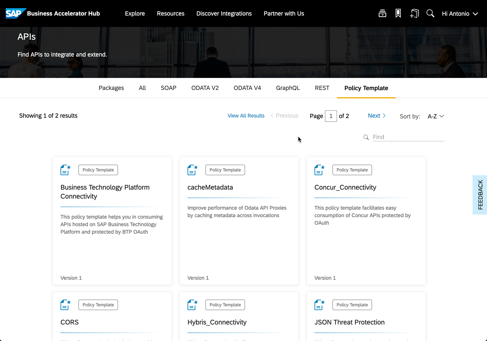
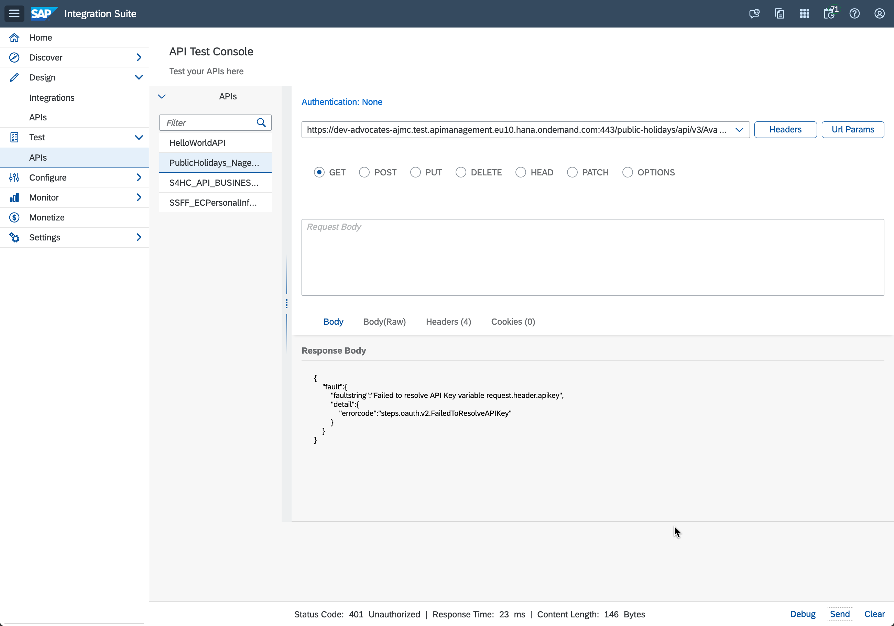

# Exercise 10 - API policies

So far, we've created and published APIs in SAP API Management but haven't added any additional functionality. In this exercise, we will explore some of the additional functionality that SAP API Management provides, allowing us to add common API functionality to our APIs, e.g., secure the API, modify headers, transform message formats, or implement [rate limits](https://help.sap.com/docs/SAP_CLOUD_PLATFORM_API_MANAGEMENT/66d066d903c2473f81ec33acfe2ccdb4/bf441dc839034613b059cb508ad610f7.html?locale=en-US).

At the end of this exercise, you'll be familiar with some basic API policies and how to apply them to your APIs.

## Policies

The additional functionality can be set in SAP API Management in the form of [Policies](https://help.sap.com/docs/SAP_CLOUD_PLATFORM_API_MANAGEMENT/66d066d903c2473f81ec33acfe2ccdb4/7e4f3e590f164996994cddc8e48bf7f5.html?locale=en-US). A policy is a program that executes a specific function at runtime, allowing us to add the extra functionality to our API. 

A policy can be applied to the request or response of an API call. For example, we can add a policy to our API that will add a header to the request or response. We can also add a policy to transform the request or response body from one format to another.

## Policy Templates

There are several API security best practices that are provided to us in the form of policy templates. These policy templates are pre-configured policies that we can import into our SAP API Management instance and apply to our APIs.

👉 Take some time and navigate to the SAP Business Accelerator Hub and check out the available Policy Templates - https://api.sap.com/content-type/API/apis/policytemplate.

     
    <i>Policy Templates in SAP Business Accelerator Hub</i>

## Import Policy Template

In exercise 09, we highlighted that anonymous users are making our API calls. In this exercise, we will add a policy to our Nager Date Public Holidays API requiring the API caller to provide a valid API key. This is so that we can easily identify the application making the API call by specifying an API Key in the requests. Still, before we can do that, we will import a policy template to our SAP API Management instance that will allow us to do that.

In your exploration a minute ago, you might have noticed that there are two policy templates that deal with verifying an API key ([Verify APIKey by Header](https://api.sap.com/policytemplate/Verify_APIKey_ByHeader) and a [Verify APIKey by QueryParam](https://api.sap.com/policytemplate/Verify_APIKey_ByQueryParam)). Let's import the Verify APIKey by Header policy template to our SAP API Management instance.

👉 In SAP Integration Suite, navigate to `Discover > APIs` and search for `SAP API Management Security Best Practices`. In the artefacts tab, you'll find the Verify APIKey policy template. Copy the `Verify APIKey By Header` policy template.

     
    <i>Copy policy template to SAP API Management instance</i>

Once copied to our SAP API Management instance, you can find the policy template in the `Design > APIs` view under the `Policy Templates` tab.

     APIs" src="assets/design-policy-templates.png" width="75%"/> 
    <i>Policy templates in SAP API Management instance</i>

## Apply Policy Template

Now that we have the policy template in our SAP API Management instance, we can apply it to our API. Let's apply the policy template to the SAP S/4HANA Cloud Business Partner API.

👉 Navigate to the `PublicHolidays_Nager_Date_API` API and click the Policies button.

     
    <i>Access Policy Editor</i>

The policy editor will open, and you'll see that there are no policies applied to the API. So, let's add the `Verify APIKey By Header` policy template to the API.

👉 Click the `Edit` button to enter edit mode and apply the `Verify APIKey By Header` policy to the API.

     
    <i>Apply policy template</i>

⏱️ Take some time and familiarise yourself with the code included in the policy. This will also be an excellent time to check documentation for the Verify API Key policy type to understand what the policy does and how it works - https://help.sap.com/docs/sap-api-management/sap-api-management/verify-api-key.

👉 Now that we have applied the policy to the API, let's click the `Update` button to update the policies of the API in the Policy Editor, followed by the Save button to save the changes in the API, and we can deploy the API, so that the changes are applied to the API.

     
    <i>Update policies and deploy API</i>

## Testing our API with a policy

Excellent, we are ready to call our API. Let's try to call the API without an API key.

👉 Navigate to the API Test Console (`Test > APIs`) and try calling any resource of the `PublicHolidays_Nager_Date_API` API. 

     
    <i>Testing the Verify API Key policy</i>

Success!!!! You are getting an HTTP 401 error! Meaning that we've applied a policy to our API correctly and now an API key is required in our request for the API call to be accepted.

> 🧐 Can you think of what can we do now to get an API key so that we can successfully call the API?

## Summary

Now that you are familiar with the basic functionality of policies in SAP API Management, we are ready to include some additional functionality to some of the APIs we deployed/published in previous exercises. Also, we need to figure out how we can successfully call the API by specifying an API key.

## Further reading

* [Policy Types available in SAP API Management](https://help.sap.com/docs/sap-api-management/sap-api-management/policy-types?locale=en-US)
* [Consume APIs > Create an Application](https://help.sap.com/docs/sap-api-management/sap-api-management/creating-application-with-application-developer-role-new-design?locale=en-US)

---

If you finish earlier than your fellow participants, you might like to ponder these questions. There isn't always a single correct answer and there are no prizes - they're just to give you something else to think about.
1. Can you imagine why you would prefer to pass an API key as a header instead of a query parameter?
2. If you are communicating with the SAP Business Accelerator Hub sandbox environment, you need to specify an API key (AK1).... now this API key will be different than the one you need to communicate with the API proxy exposed via SAP API Management (AK2). Why is that? and how can you set the API key required by the sandbox environment (AK1) to communicate with it via SAP API Management but still add the Verify API Key functionality in SAP API?
    

    
Hint 🔦

    <i>Check out the <b>Assign Message</b> policy type. This policy allows you to create new or modify an existing HTTP request or response message, see [documentation](https://help.sap.com/docs/sap-api-management/sap-api-management/assign-message).</i>
    

<!-- ## Next

Continue to 👉 [Exercise XX - ](../02-exploring-the-mock-services/README.md#exercise-02---exploring-the-mock-services) -->