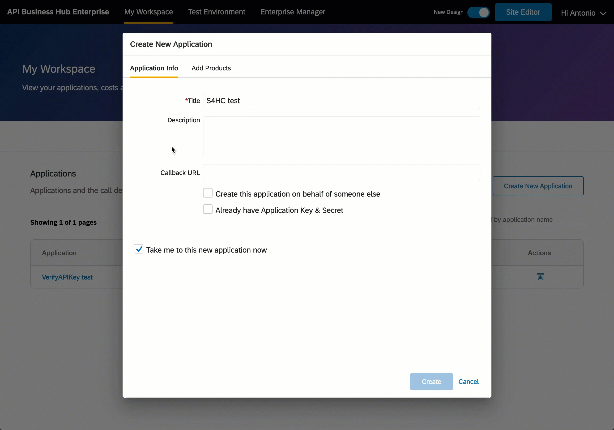
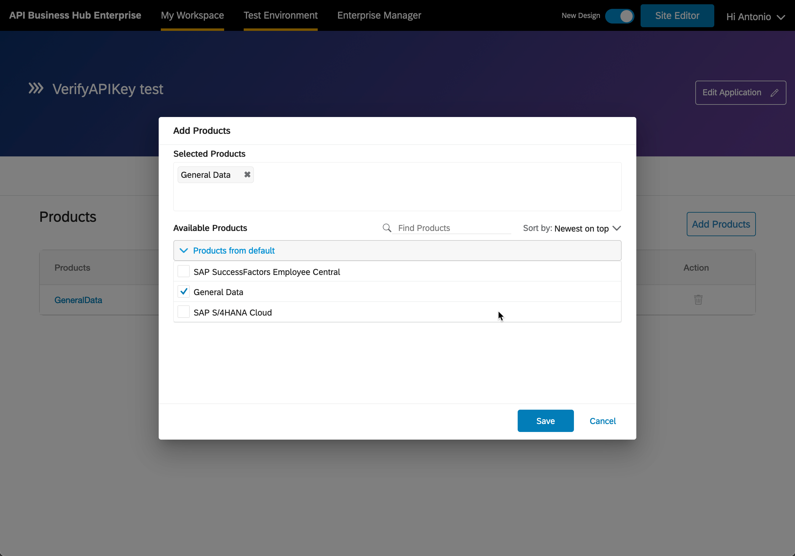
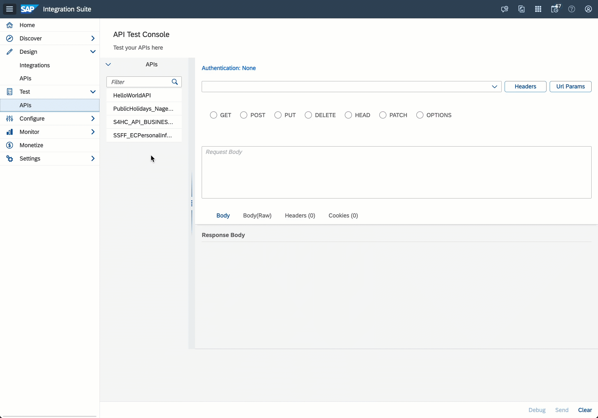

# Exercise 12 - Protecting our APIs

Our main business system (SAP S/4HANA Cloud) requires basic authentication to be able to call the API. That said, there is no limit on the number of calls that we make to the system. As you can imagine this can be a problem, as an application/developer making too many concurrent/simultaneous calls can end up affecting system performance.

Let's explore what we can do to mitigate this.

## Identify the developer/application calling our API

At the moment we are unable to identify the developer that's calling the API proxy that we created for our SAP S/4HANA Cloud Business Partner API. Before we can set a policy that can control the number of calls made by an application/developer, we will first need to apply the same policy that we applied in exercise 10, the [Verify API Key](https://help.sap.com/docs/sap-api-management/sap-api-management/verify-api-key) policy. 

> For a step by step explaination revisit the [Apply Policy Template section in exercise 10](../10-api-policies/README.md#apply-policy-template)

👉 Navigate to the policy editor of the `S4HC_API_BUSINESS_PARTNER` API and apply the `Verify APIKey By Header` policy to the API. `Update` and `deploy` so that the policy comes into effect.

> When applying the `Verify API Key` policy we can set a different name for the header that SAP API Management needs to check. This might be required if we are using the sandbox environment of the SAP Business Accelerator Hub as the backend system. 
> ```xml
> <VerifyAPIKey async='true' continueOnError='false' enabled='true' xmlns='http://www.sap.com/apimgmt'>
>	<APIKey ref='request.header.apim-apikey'/>
> </VerifyAPIKey>
> ```

## Create a new application

In the previous exercise, we learned how to create an application in the API Business Hub Enterprise. Let's go ahead and create a separate application that will only have access to our SAP S/4HANA Cloud product.

👉 Navigate to your `workspace` in the `API Business Hub Enterprise`. Create a new application named `S4HC test` and assign the `SAP S/4HANA Cloud` product. 

<p align = "center">
    <br/>
    <i>S4HC application with product associated</i>
</p>

> For a step by step explaination revisit the [Create an Application in API Business Hub Enterprise section in exercise 11](../11-consume-applications/README.md#create-an-application-in-api-business-hub-enterprise)

<details>
<summary>🤔 Can you think of an alternative to creating a new application?</summary>
<br>

We could have added a new product to our previously created application...

<p align = "center">
    <br/>
    <i>Adding product to existing application</i>
</p>
</details>


🧭 Take some time to revisit the monitoring of our APIs (`Monitor > APIs`). You should now see two applications and calls to different APIs.

### (Optional) Test the Verify API Key policy changes

To ensure that everything is working fine, I encourage you to test the changes from the API Test Console. You should get an HTTP 401 response status code, meaning that our API proxy now expects an SAP API Management application key to let the call through. Also, we are now able to identify who is calling our API.

<p align = "center">
    <br/>
    <i>SAP S/4HANA Cloud Business Partner API proxy with Verify API Key header</i>
</p>

> We need to specify the `APIM-APIKey` header and the authentication details of our SAP S/4HANA Cloud system to get a successful call.

## Spike Arrest policy

Now that we can identify who is calling our API, we can proceed to add some additional security to it. In our case, we want to specify a policy that can control the number of calls made by the applications/developers calling our API proxy. Enter the [Spike Arrest](https://help.sap.com/docs/sap-api-management/sap-api-management/spike-arrest) policy.

The Spike Arrest policy limits the number of requests forwarded to the target system. Using this policy we can specify the number of requests that can be sent in an interval of time, e.g. we can limit the number of calls that can be made in a minute. Let's say we want to allow 12 calls per minute, this would mean that the caller can only make a call every 5 seconds - (12 calls / 1 minute -> 60 seconds = 1 call every 5 seconds).

👉 Navigate to the policy editor of the `S4HC_API_BUSINESS_PARTNER` API and add a Spike Arrest policy in the `Proxy Endpoint > PreFlow`, after the `checkAPIKey` policy that's already in place. 

Ensure the value in the `Identifier` ref matches the `Identifier` set for the API key, e.g. `request.header.apim-apikey`. Also, in the example, we can see the Rate set is 12 calls per minute, `12pm`, a call every 5 seconds.

<p align = "center">
    <br/>
    <i>Including Spike Arrest policy</i>
</p>

Below you can find the contents of the policy set in the animation above.

```xml
<SpikeArrest async="true" continueOnError="false" enabled="true" xmlns="http://www.sap.com/apimgmt">
	<!-- can be used to uniquely identify an application or a client -->
	<Identifier ref="request.header.apim-apikey"/>
	<!-- used to modify the impact of a single request on the calculation of spike arrest limit. If the weight is 5 and the spike limit is 10 per minute then only 2 requests are permitted to this proxy in one minute -->
	<MessageWeight ref="request.header.weight"/>
	<Rate>12pm</Rate>
	<UseEffectiveCount>true</UseEffectiveCount>
</SpikeArrest>
```

👉 Update the policy and deploy the API to activate the changes.

## Test the Spike Arrest policy

Now that we've re-deployed the API, we are ready to test the Spike Arrest policy. This is a simple test, just try sending multiple requests to the API in a short period and the policy will kick in.

👉 Navigate to the API Test Console, select the `S4HC_API_BUSINESS_PARTNER` API and send a few requests fast so that we can see the Spike Arrest exception being raised.

<p align = "center">
    <br/>
    <i>Multiple calls - Spike arrest exception raised</i>
</p>

> If you are interested in learning advance techniques to protect your APIs, please review the content available in [optional exercise 02 - API Security Best Practices](../optional-02-security-best-practices/README.md)

## Summary

We should now have a better understanding of API policies and be comfortable applying some basic security on our API proxies. We've learnt about the Spike Arrest policy and how it can protect our backend systems from receiving too many concurrent/simultaneous calls from a single application/developer and prevent a potential performance impact in the system.

## Further reading

* [Spike Arrest policy](https://help.sap.com/docs/sap-api-management/sap-api-management/spike-arrest)
* [Quota policy](https://help.sap.com/docs/sap-api-management/sap-api-management/quota?locale=en-US)

---

If you finish earlier than your fellow participants, you might like to ponder these questions. There isn't always a single correct answer and there are no prizes - they're just to give you something else to think about.

1. In which scenario will it make sense to grant an application access to multiple products? 
2. The spike arrest policy and the quota policy are similar but there is an important difference between them. What is it?
3. Let's imagine you've applied the quota policy to an API. You might have noticed that we can specify a quota for a product in the Product Overview tab (`Design > APIs > Products` tab - select any Product). Which of these quotas takes precedence?
4. Can you think of other policies, which you can apply to your APIs, and can ease the load of the server? 

## Next

Continue to 👉 [Exercise 13 - Editing API paths, operations, and documentation](../13-api-designer/README.md)