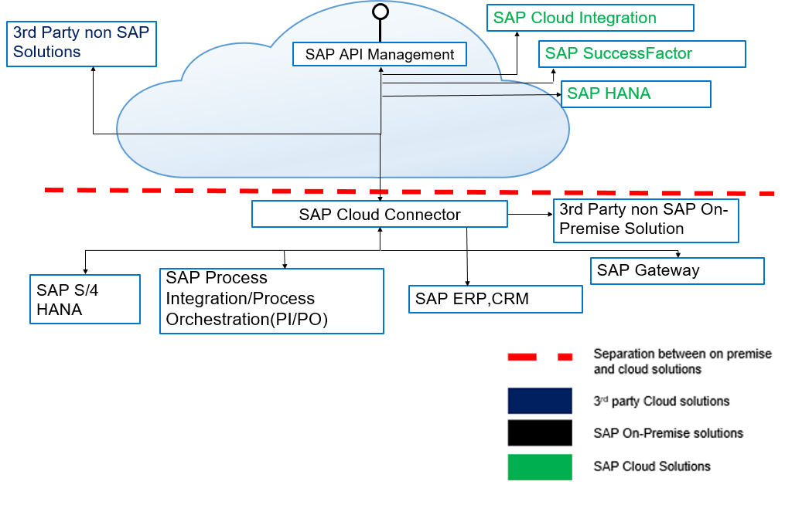

# Optional Exercise 03 - API Providers

An API provider defines the connection details for services running on specific hosts whose details you want to access. Via an API Provider, we can configure API Management to access the data of an SAP Gateway service, SAP S/4HANA, on-premises or cloud solutions.

     
    <i>API Provider diagram</i>

At the end of this exercise, you'll have an understanding of the API Providers' capability part of API Management.

## Create an account on the SAP Gateway Demo system

Before we can create an API Provider in API Management we will first need the required access to an SAP system. For this, we will use the [SAP Gateway Demo system (ES5)](https://register.sapdevcenter.com/SUPSignForms) that's publicly available. 

👉 Perform all the steps in the [tutorial: Create an Account on the SAP Gateway Demo System](https://developers.sap.com/tutorials/gateway-demo-signup.html).

Now that we have access to an SAP Gateway, we can proceed to set up an API provider in API Management.

## Create an API Provider

As mentioned in the introduction, we can define the connections details to the ES5 Gateway in the API Provider. In our case the system is publicly accesible via the internet but do know that you can also use API providers to connect via Cloud Connector to your on-premises systems.

> Using an API provider to connect to an on-premises system was covered in the opening keynote of SAP TechEd 2022, check it out - https://youtube.com/clip/UgkxJC8Z9bv9p2sJxDh9Ul_UVVhnZhLovCVG?si=9lfdg_DoBPtrPCHa

Let's go ahead and create the API Provider that we will use to connect to the ES5 Gateway Demo system.

👉 Perform steps 3-10 of the [tutorial: Create an API Provider System](https://developers.sap.com/tutorials/hcp-apim-create-provider.html#7bd0c4c9-e4f0-492d-b966-bf221d84fab2).

## Discovery of services exposed by an API Provider

Now that you've created the API Provider, we can go ahead and create an API proxy for the services that are available in the API Provider. In the case of the ES5 Gateway Demo system, we can use the Discover Services option available when creating an API Proxy.

Let's go ahead and create the API proxy for the `GWSAMPLE_BASIC` service exposed by the ES5 Gateway Demo system.

👉 Perform steps 3-11 of the [tutorial: Create an API Proxy](https://developers.sap.com/tutorials/hcp-apim-create-api.html#3c87bc1e-46b8-454a-82d0-af1a768694c9).

## Summary

Congratulations on completing this optional exercise!!! 🎉 🙌. This is no easy feat as there is a lot to read/learn/process in the CodeJam and you need to dedicate some solid focus time to go through the exercises. Great job 👏👏👏!

We've achieved a lot in this exercise. We created an API Provider and create a proxy to a service exposed by the API Provider. We also test the communication to this service via API Management.

## Further reading

* [API Providers](https://help.sap.com/docs/sap-api-management/sap-api-management/api-providers?locale=en-US)
* [Security Best Practices - Policy Templates](https://api.sap.com/package/SecurityBestPractices/policytemplate)
* [Additional Attributes in OpenAPI Specification](https://help.sap.com/docs/SAP_CLOUD_PLATFORM_API_MANAGEMENT/66d066d903c2473f81ec33acfe2ccdb4/35f357c811f546c5ae3451df42f61ea0.html?locale=en-US)

---

If you finish earlier than your fellow participants, you might like to ponder these questions. There isn't always a single correct answer and there are no prizes - they're just to give you something else to think about.

1. Go ahead and publish the API proxy created in the API Business Hub Enterprise.
2. How can we configure SAP Cloud Integration as an API Provider?
3. What component do we need to create to configure the connection to an on-premises system in SAP API Management?
