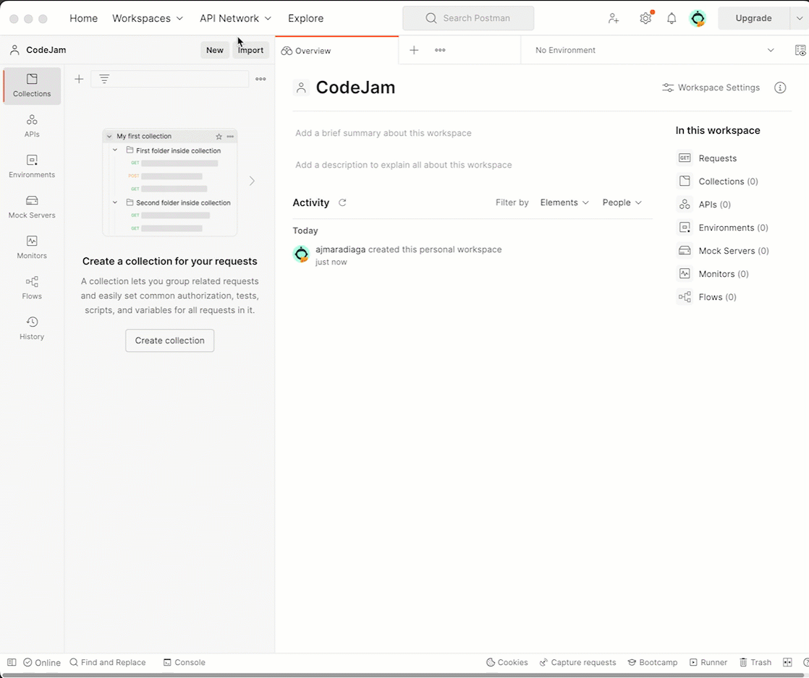
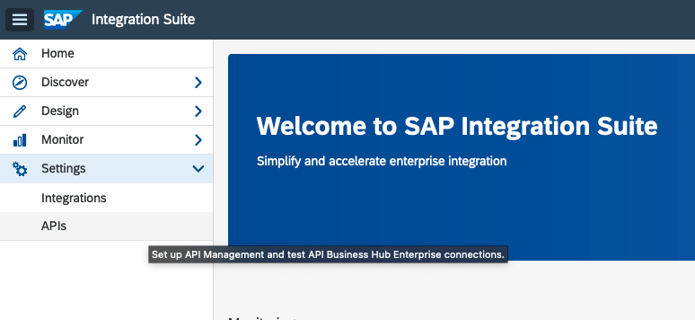
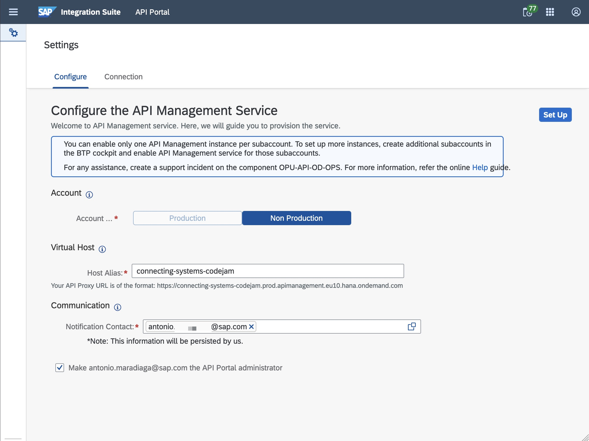
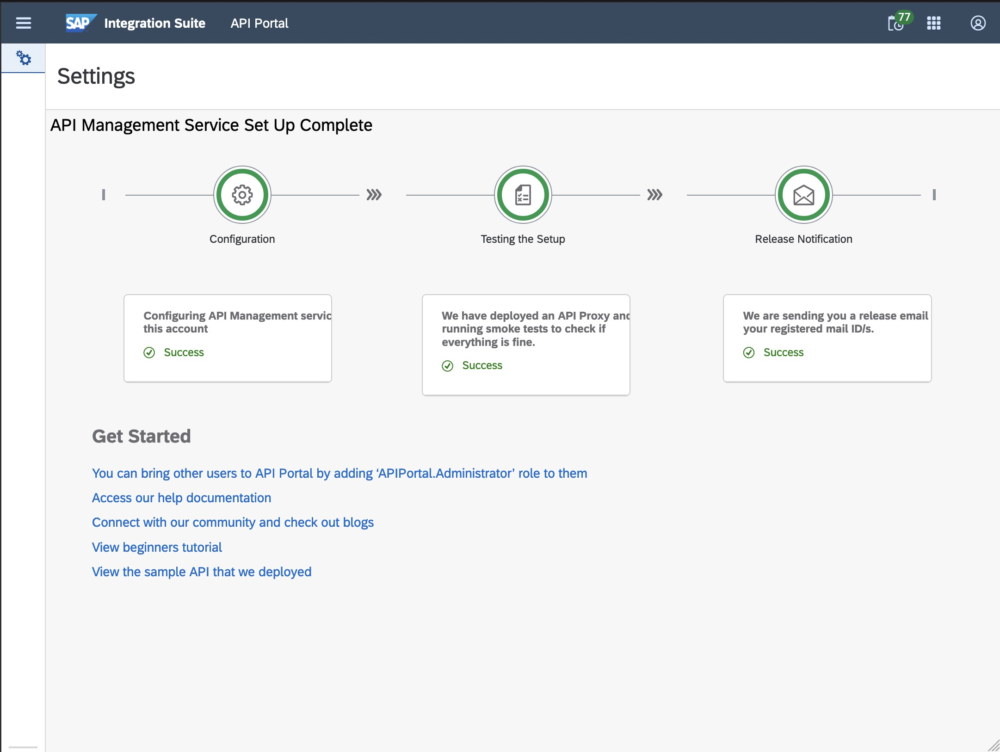
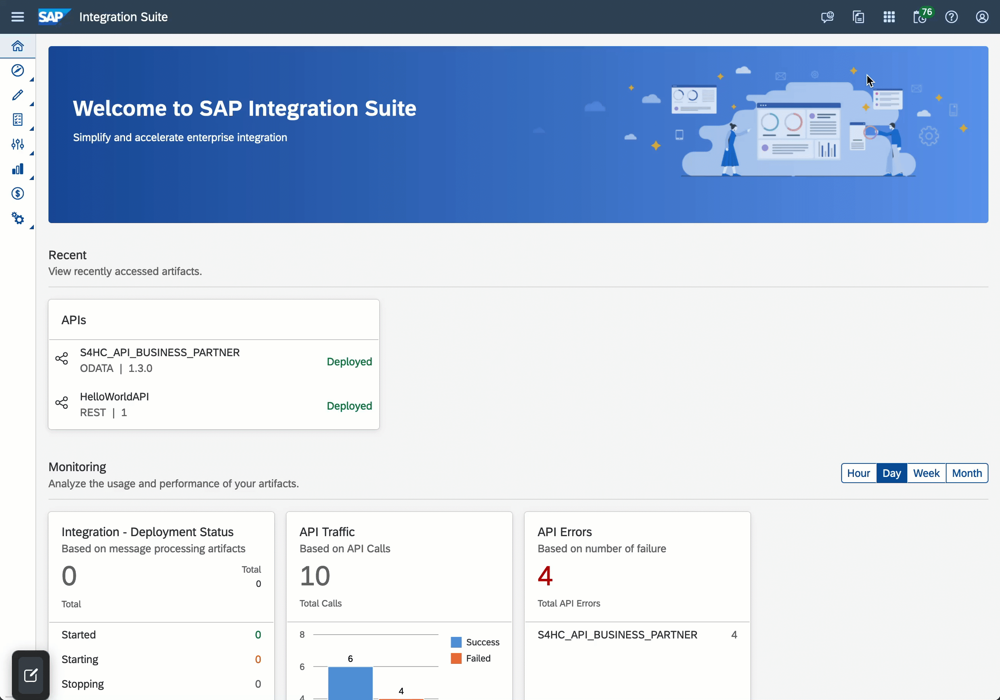
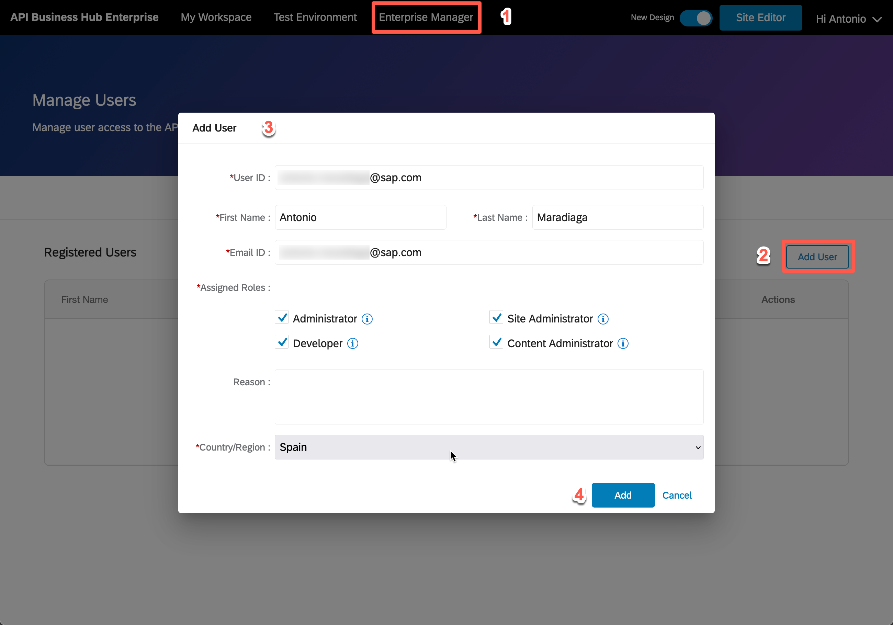
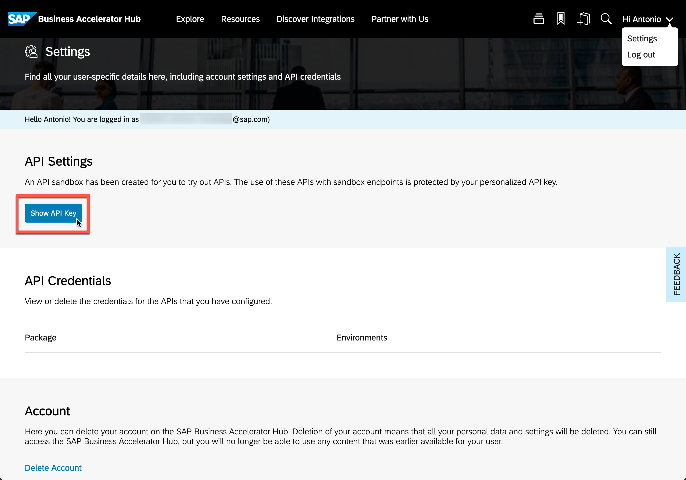

# Prerequisites

There are hardware, software and service prerequisites for participating in this CodeJam. The exercises will be developed using the SAP API Management capability of SAP Integration Suite and communicating with remote services that will be made available for the CodeJam. 

## Accessing the supporting material referenced in exercises

In this CodeJam, you will see that across exercises, there are references to files that will help you get started or that are needed to complete the activities. To access these files, you can download the individual files directly from the repository website, or you can make a copy of the repository on your local machine by following one of the options below:
1. **(Recommended)** Clone the git repository in your local machine with the following command:
   ```bash
   $ git clone https://github.com/SAP-samples/manage-apis-codejam.git
   ```
   > If you've set up [SSH to communicate with GitHub](https://docs.github.com/en/authentication/connecting-to-github-with-ssh) from your local machine, you can clone it using the following command: `git clone git@github.com:SAP-samples/manage-apis-codejam.git`

   Using `git` is recommended as there might be future updates on the CodeJam content; updating your local copy will just be a command away.

   ```bash
   $ git pull origin main
   ```
2. Alternatively, download the [repository as a zip](https://github.com/SAP-samples/manage-apis-codejam/archive/refs/heads/main.zip), and unzip it.

## Hardware

None.

## Software

### Web browser

A web browser supported by the SAP Integration Suite[^1]: For the UIs of the service, the following browsers are supported on Microsoft Windows PCs and, where mentioned below, on macOS. Note that, however, certain limitations might apply for specific browsers:

```
Cloud Integration has been tested using the following browsers:
- Google Chrome (latest version)
- Microsoft Edge (latest version)
- Mozilla Firefox (latest version)
- Windows Internet Explorer (as of version 10)

The application can also be used with Safari browser and Internet Explorer 9. However, some features might not work as expected.
```

### Postman

[Postman](https://www.getpostman.com/downloads/), used to get familiar with the SAP S/4HANA Cloud API and send some requests to an SAP Cloud Integration iFlow. Follow the installation instructions included in this [tutorial: Install Postman REST Client](https://developers.sap.com/tutorials/api-tools-postman-install.html).
  > Once installed you can import the collection and environments included in the `./manage-apis-codejam/assets/postman` folder.

  > 

## Services

<details>
<summary>Using the SAP BTP Free Tier (⚡️ recommended ⚡️)</summary>

<br>

* Get a free SAP Business Technology Platform account (if you don't already have one):
  * [Tutorial: Get an Account on SAP BTP to Try Out Free Tier Service Plans](https://developers.sap.com/tutorials/btp-free-tier-account.html)
  * [Video: SAP BTP Free Tier: Create Your Individual Account](https://www.youtube.com/watch?v=0zGuMus4R10)
* Subscribe to the SAP Integration Suite service by following the instructions included in [step 2](https://developers.sap.com/tutorials/cp-starter-isuite-onboard-subscribe.html#754869b5-274f-4a7d-b195-f4082f790b0d) of the _Set up the SAP Integration Suite trial_ tutorial. 

</details>

<details>
<summary>Using the SAP BTP Trial account</summary>

<br>

* Get an SAP Business Technology Platform trial account:
  * [Tutorial: Get an account on SAP BTP Trial](https://developers.sap.com/tutorials/hcp-create-trial-account.html)
  * [Tutorial: Set up the SAP Integration Suite trial](https://developers.sap.com/tutorials/cp-starter-isuite-onboard-subscribe.html#f55ec71c-2853-4b83-8092-4e3031f8d6e6)

</details>

### Activating SAP Integration Suite capabilities

Once subscribed to the SAP Integration Suite service, we will need to provision the following capabilities:
- API Management

To provision the SAP Integration Suite capabilities, follow the instructions included in [step 3](https://developers.sap.com/tutorials/cp-starter-isuite-onboard-subscribe.html#d87e7e9f-7862-410d-ae85-ede409587a60) of the  _Set up the SAP Integration Suite trial_ tutorial.


### Set up the SAP API Management capability

> 🚨 This is only required if you are running in a non-trial environment

<details>
<summary>Complete setup of SAP API Management (👉 <i><b>when not running in the trial environment</b></i> 👈)</summary>
<br/>
Before being able to access API Management, you will need to complete the setup. Go to the API Management settings by navigating within the Integration Suite UI to *Settings > APIs*.

<p align = "center">
  <br/>
  <i>API Management settings</i>
</p>

Enter a host alias, add a notification contact (your email address) and click the `Set Up` button on the upper right corner.

<p align = "center">
  <br/>
  <i>Set up API Management capability</i>
</p>

<p align = "center">
  <br/>
  <i>Set up API Management - Complete</i>
</p>

For detailed steps, follow the instructions included in [step 5 - Configure the API Management Service](https://developers.sap.com/tutorials/api-mgmt-isuite-initial-setup.html#93fee77e-606e-425c-a6c3-1b6946d2ec87) of the  _Set Up API Management from Integration Suite_ tutorial. 

</details>

### Assign the SAP API Management Role Collections to your user

Once the capability is active, make sure you assigned the following role collections to your user:
* *APIManagement.**
* *APIPortal.**
* *AuthGroup.**

> For simplicity purposes, assign all the roles that match the patterns provided below

Go to your SAP BTP Cockpit. Navigate to `Security > Users`, select your User and click the `Assign Role Collections` button.

### Register as a developer in the API Business Hub Enterprise

Once you've set up SAP API Management, you can access the API Business Hub Enterprise from the SAP Integration Suite home page. 

Navigate to the API Business Hub Enterprise

<p align = "center">
<br/>
<i>Link to API Business Hub Enterprise</i>
</p>

Hover over the `Enterprise Manager` item in the navigation bar and select `Manage - Users`. Go to the `Registered Users` tab and click the `Add User` button. Enter your user details, assign the required roles and click the `Add` button.

<p align = "center">
  <br/>
  <i>Add user to Registered Users</i>
</p>

If everything went fine, you've successfully registered your user as a registered user of the API Business Hub Enterprise.

### SAP Business Accelerator Hub API Key

If you are going through the CodeJam content on your own or don't have access to a live system, you can use the sandbox environment available as part of the SAP Business Accelerator Hub. To communicate with the sandbox environment you will need an API key. The gif below shows you how you can get an API key from the SAP Business Accelerator Hub.


<p align = "center">
<i>Show API key in the SAP Business Accelerator Hub</i>
</p>

An alternative would be going to your profile settings and clicking the `Show Key` button in your profile.

<p align = "center">
  <br/>
  <i>Show Key button in profile settings</i>
</p>

[^1]: [Feature Scope Description for SAP Integration
Suite](https://help.sap.com/doc/e50e61e7b66c4b60ae5e88c00c01486a/sap.cp.integration.suite/en-US/FSD_IntegrationSuite.pdf)
