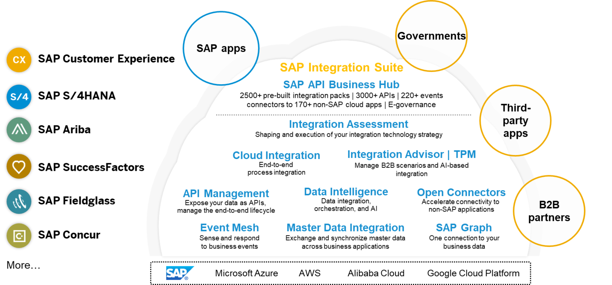
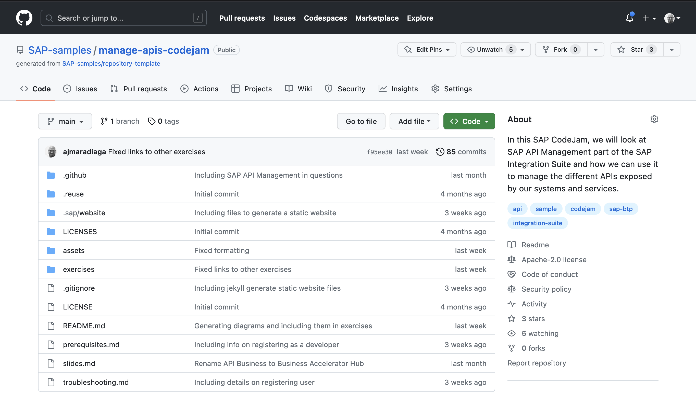

<!-- _class: frontpage -->

        

# SAP CodeJam: Managing APIs in your landscape with SAP API Management

 

Antonio Maradiaga 
*Developer Advocate @ SAP*

  
2023

<!-- ---
# SAP CodeJam
*Connecting systems and services
using SAP Integration Suite*

 
Antonio Maradiaga

*Developer Advocate @ SAP*

  
October, 2022

 -->
---
<!-- paginate: true -->

# SAP Integration Suite

--- 

# SAP Integration Suite

--- 

# SAP CodeJam - Integration scenario

<!-- _class: centersingleimage -->

--- 

# SAP CodeJam - Repository
 

--- 

<!-- _footer: "*[Troubleshooting](https://github.com/SAP-samples/connecting-systems-services-integration-suite-codejam/blob/main/troubleshooting.md#troubleshooting): Whenever you face an issue, make sure to check this page first.*" -->

# SAP CodeJam - Exercises

* [Exercise 01 - Getting familiar with the SAP Business Accelerator Hub](./01-getting-familiar-business-accelerator-hub/README.md#exercise-01---getting-familiar-with-the-sap-business-accelerator-hub)
* [Exercise 02 - ]
* [(Optional) Exercise 01 - Running locally services used in CodeJam](./optional-01-running-locally/README.md#optional-exercise-01---running-locally-services-used-in-codejam)

--- 
<!-- _class: centersingleimage -->

# Exercise 01 - Getting familiar with the SAP Business Accelerator Hub

--- 
<!-- _class: centersingleimage -->

# Exercise 02 - 

--- 
<!-- _class: lead -->

# Thank you for attending!!!

- Issues: You can [create an issue](https://github.com/SAP-samples/manage-apis-codejam/issues/new) in this repository if you find a bug or have questions about it.
- [Feedback](https://github.com/SAP-samples/manage-apis-codejam/issues/new?assignees=&labels=feedback&template=session-feedback-template.md&title=Feedback): If you can spare a couple of minutes at the end of the session, please help us improve for next time by giving me some feedback.
