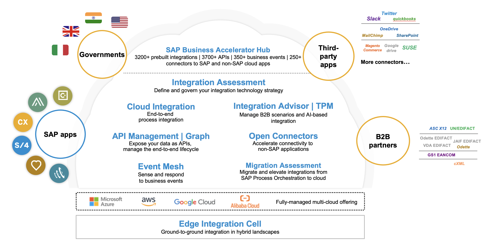
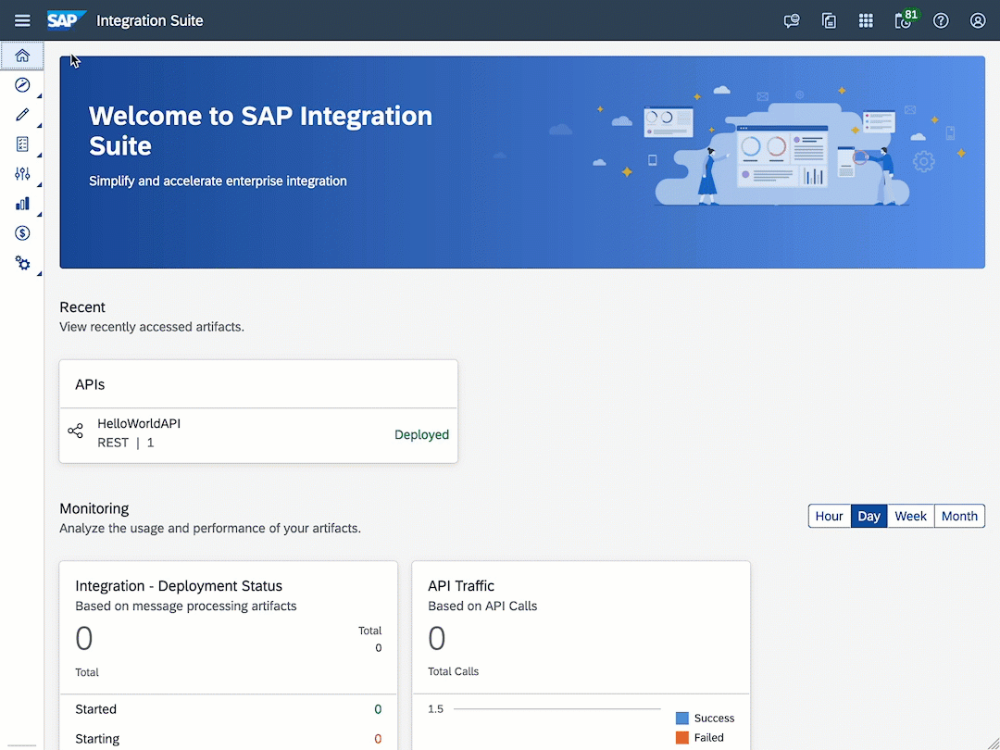
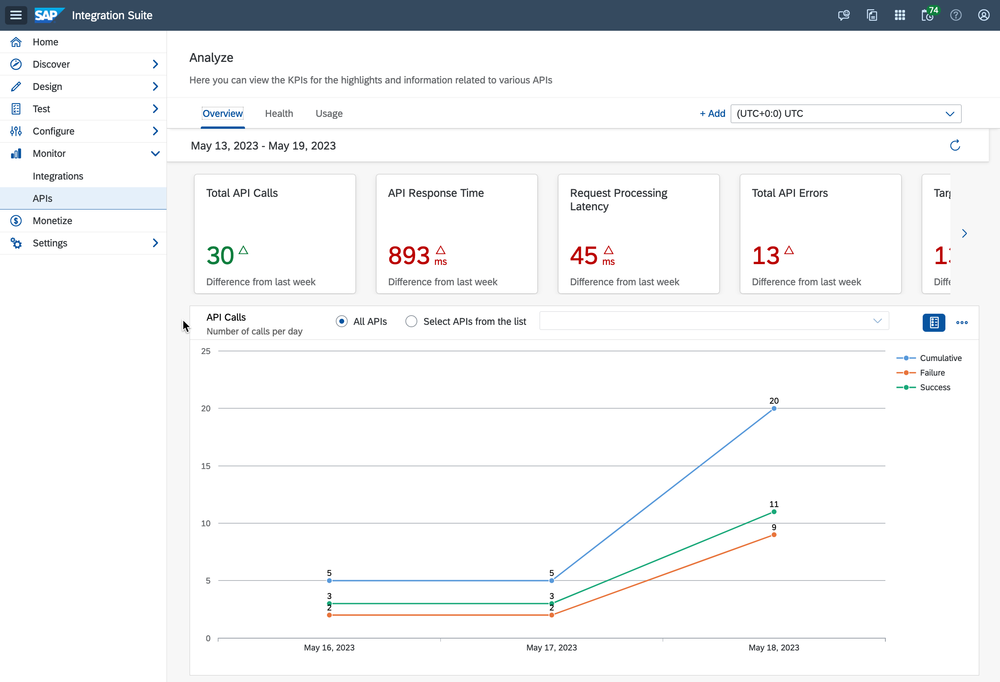

<!-- 
<!-- _class: frontpage ->
        

# SAP CodeJam: Managing APIs in your landscape with SAP API Management

 

Antonio Maradiaga 
*Developer Advocate @ SAP*

  
2023

<!-- ---
# SAP CodeJam
*Connecting systems and services
using SAP Integration Suite*

 
Antonio Maradiaga

*Developer Advocate @ SAP*

  
October, 2022

 -->

<!-- paginate: false -->

---
<!-- paginate: false -->

---
<!-- paginate: true -->

# SAP Integration Suite

--- 

# SAP CodeJam - API Management scenario

<!-- _class: centersingleimage -->

--- 

# [SAP CodeJam - Repository](https://github.com/SAP-samples/manage-apis-codejam/)
 
 <!-- _class: centersingleimage -->

--- 

<!-- _footer: "*[Troubleshooting](https://github.com/SAP-samples/manage-apis-codejam/blob/main/troubleshooting.md#troubleshooting): Whenever you face an issue, make sure to check this page first.*" -->

# SAP CodeJam - Exercises (Part 1)

 

* [Exercise 01 - The OpenAPI specification](./exercises/01-open-api-specification/README.md#exercise-01---the-openapi-specification)
* [Exercise 02 - Getting familiar with the SAP Business Accelerator Hub](./exercises/02-getting-familiar-business-accelerator-hub/README.md#exercise-02---getting-familiar-with-the-sap-business-accelerator-hub)
* [Exercise 03 - Discover and import an API](./exercises/03-discover-and-import-api/README.md#exercise-03---discover-and-import-an-api)
* [Exercise 04 - Deploy an API](./exercises/04-deploy-an-api/README.md)
* [Exercise 05 - Testing an API using the API Test Console](./exercises/05-testing-api/README.md)
* [Exercise 06 - Publishing our API](./exercises/06-publish-api/README.md)
* [Exercise 07 - Import an API using an OpenAPI specification](./exercises/07-import-api-openapi-spec/README.md)

  

--- 

<!-- _footer: "*[Troubleshooting](https://github.com/SAP-samples/manage-apis-codejam/blob/main/troubleshooting.md#troubleshooting): Whenever you face an issue, make sure to check this page first.*" -->

# SAP CodeJam - Exercises (Part 2)

 

* [Exercise 08 - Add an SAP SuccessFactors Employee Central API](./exercises/08-add-ssff-employee-central-api/README.md)
* [Exercise 09 - Monitoring APIs](./exercises/09-monitoring-apis/README.md)
* [Exercise 10 - API policies](./exercises/10-api-policies/README.md)
* [Exercise 11 - Consume protected APIs by creating an application](./exercises/11-consume-applications/README.md)
* [Exercise 12 - Protecting our APIs](./exercises/12-protecting-apis/README.md)
* [Exercise 13 - Editing API paths, operations, and documentation](./exercises/13-api-designer/README.md)
    
--- 

<!-- _footer: "*[Troubleshooting](https://github.com/SAP-samples/manage-apis-codejam/blob/main/troubleshooting.md#troubleshooting): Whenever you face an issue, make sure to check this page first.*" -->

# SAP CodeJam - Exercises (Optional)

  

* [Optional Exercise 01 - Expose integration flow via API Management](./exercises/optional-01-expose-integration-flow-api-management/README.md)
* [Optional Exercise 02 - API Security Best Practices](./exercises/optional-02-security-best-practices/README.md)

        

--- 
<!-- _class: centersingleimage -->

# [Exercise 01 - OpenAPI specification](./exercises/01-open-api-specification/README.md)
  

     

--- 
<!-- _class: centersingleimage -->

# [Exercise 02 - Getting familiar with the SAP Business Accelerator Hub](./exercises/02-getting-familiar-business-accelerator-hub/README.md)

--- 
<!-- _class: centersingleimage -->

# [Exercise 03 - Discover and import an API](./exercises/03-discover-and-import-api/README.md#exercise-03---discover-and-import-an-api)

--- 
<!-- _class: centersingleimage -->

# [Exercise 04 - Deploy an API](./exercises/04-deploy-an-api/README.md)

--- 
<!-- _class: centersingleimage -->

# [Exercise 05 - Testing an API using the API Test Console](./exercises/05-testing-api/README.md)

--- 
<!-- _class: centersingleimage -->

# [Exercise 06 - Publishing our API](./exercises/06-publish-api/README.md)

--- 
<!-- _class: centersingleimage -->

# [Exercise 07 - Import an API using an OpenAPI specification](./exercises/07-import-api-openapi-spec/README.md)

--- 
<!-- _class: centersingleimage -->

# [Exercise 08 - Add an SAP SuccessFactors Employee Central API](./exercises/08-add-ssff-employee-central-api/README.md)

--- 
<!-- _class: centersingleimage -->

# [Exercise 09 - Monitoring APIs](./exercises/09-monitoring-apis/README.md)

--- 
<!-- _class: centersingleimage -->

# [Exercise 10 - API policies](./exercises/10-api-policies/README.md)

--- 
<!-- _class: centersingleimage -->

# [Exercise 11 - Consume protected APIs by creating an application](./exercises/11-consume-applications/README.md)

--- 
<!-- _class: centersingleimage -->

# [Exercise 12 - Protecting our APIs](./exercises/12-protecting-apis/README.md)

--- 
<!-- _class: centersingleimage -->

# [Exercise 13 - Editing API paths, operations, and documentation](./exercises/13-api-designer/README.md)

--- 
<!-- _class: lead -->

# Thank you for attending!!!
 

- Issues: You can [create an issue](https://github.com/SAP-samples/manage-apis-codejam/issues/new) in this repository if you find a bug or have questions about it.
- [Feedback](https://github.com/SAP-samples/manage-apis-codejam/issues/new?assignees=&labels=feedback&template=session-feedback-template.md&title=Feedback): If you can spare a couple of minutes at the end of the session, please help us improve for next time by giving me some feedback.

    
