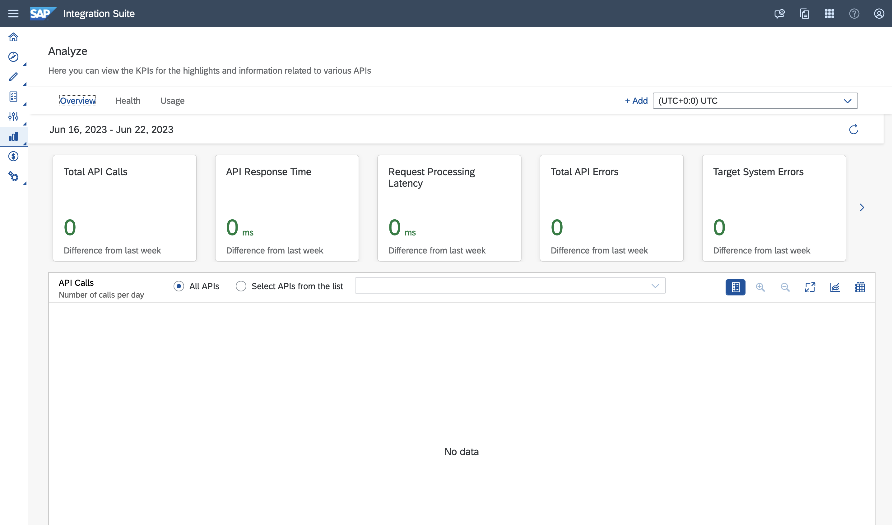

# Troubleshooting

This page intends to capture common problems that you might face while going through the exercises part of the CodeJam. 

## API Management

- #### Unable to Create application exceptions in Developer Portal
  
  When creating an application in the Developer Portal, a pop-up is displayed stating that it was not possible to create the application.

  There are two potential solutions to the problem:
  - If you are the only user, make sure you register as a Developer. Go to `Enterprise Manager > Manage - Users > Registered Users` and add your account details. Select the Developer, Administrator and Content Admin roles.
    > ❗️❗️ When creating the user, make sure to set an email address in the `User ID` field. If you specify a value that's not an email address will fail to approve/activate the user. 
  
    
    

    <i>Add user in API Business Hub Enterprise</i>
    

  - Check SAP Note 2718466: [https://launchpad.support.sap.com/#/notes/0002718466](https://launchpad.support.sap.com/#/notes/0002718466) 

- #### My API Business Hub Enterprise doesn't look the same as the one in the screenshots/animations
  You can change the look and feel of the API Business Hub Enterprise by *"turning on"* the new design.
  

     
    <i>Toggle - New design</i>
  

### When using the SAP BTP Trial environment

- #### `APIs` menu item is not listed under the `Settings` menu in the SAP Integration Suite UI

  The APIs menu item is not needed in the trial environment as the settings are automatically set on your behalf.

  

     
    <i>APIs menu item not listed under Settings</i>
  

- #### SSL Handshake failed javax.net.ssl.SSLHandshakeException: Received fatal alert: handshake_failure

  This is an intermittent issue in the SAP BTP Trial environment. No changes are required for this to work, just retry sending the request.

  

     
    <i>SSL Handshake failure in API Test Console</i>
  

- #### No API analytics are shown (Monitor > APIs) in the trial environment
  
  

     
    <i>No metering/analytics available on the SAP BTP trial environment</i>
  

  There is metering and analytics available on the SAP BTP trial environment, however the fetch time of analytics data to the design time can vary from minutes to several hours. Meaning that analytics may not be shown/updated during a CodeJam event.

- #### Unable to add user when User ID is not an email address
  
  

     
    <i>Unable to add user when User ID is not an email address</i>
  

  Please register the user specifying an email address in the User ID field.

  

     
    <i>Adding user with email address</i>
  

## Postman

- #### Could not send request - Error: getaddrinfo ENOTFOUND or Error: Invalid URI 
    
    If you get this error when sending a request, it is possible that you've not selected the right environment or that the value for a variable that's used in the URL is incorrect. Ensure that you've selected the right environment for the request you are trying to make and check the values of the variables.

- #### Unresolved variable

    The UI states that it is not possible to resolve a variable. Ensure that you've selected the right environment for the request you are trying to make.

