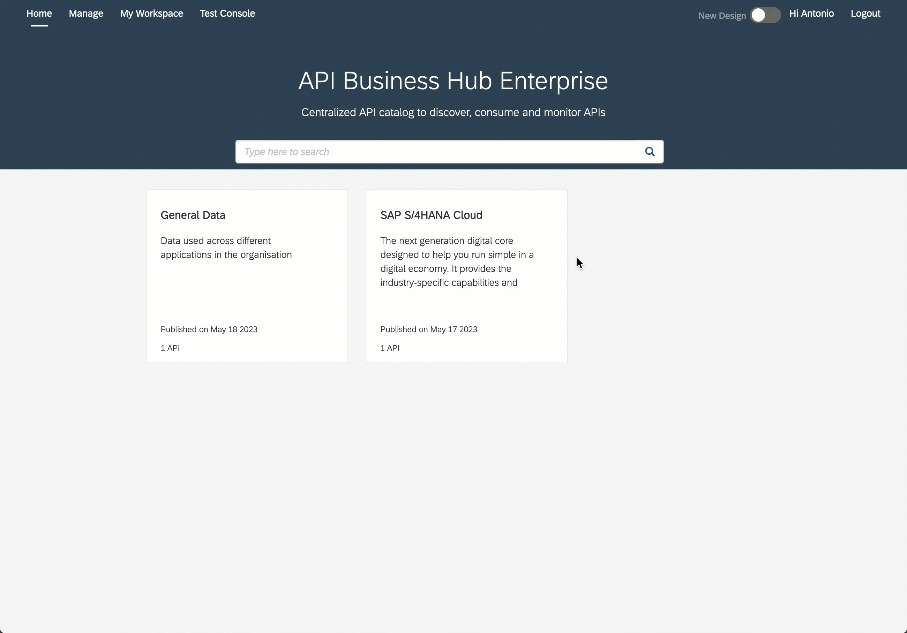

# Troubleshooting

This page intends to capture common problems that you might face while going through the exercises part of the CodeJam. 

## API Management

- #### Unable to Create application exceptions in Developer Portal
  
  When creating an application in the Developer Portal, a pop-up is displayed stating that it was not possible to create the application.

  There are two potential solutions to the problem:
  - If you are the only user, make sure you register as a Developer. Go to Manage > Manage Users > Registered Users and add your account details. Select the Developer, Administrator and Content Admin roles.
  
    
    

    <i>Add user in API Management</i>
    

  - Check SAP Note 2718466: [https://launchpad.support.sap.com/#/notes/0002718466](https://launchpad.support.sap.com/#/notes/0002718466) 

- #### My API Business Hub Enterprise doesn't look the same as the one in the screenshots/animations
  You can change the look and feel of the API Business Hub Enterprise by *"turning on"* the new design.
  

     
    <i>Toggle - New design</i>
  

## Postman

- #### Could not send request - Error: getaddrinfo ENOTFOUND or Error: Invalid URI 
    
    If you get this error when sending a request, it is possible that you've not selected the right environment or that the value for a variable that's used in the URL is incorrect. Ensure that you've selected the right environment for the request you are trying to make and check the values of the variables.

- #### Unresolved variable

    The UI states that it is not possible to resolve a variable. Ensure that you've selected the right environment for the request you are trying to make.

